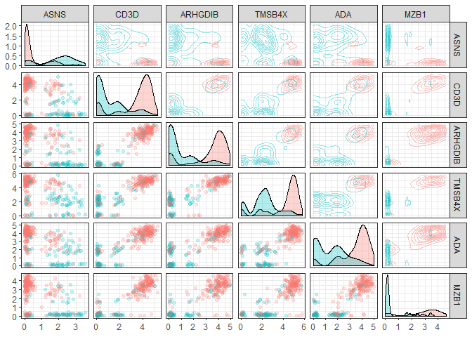
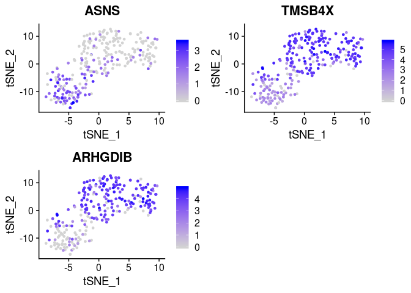
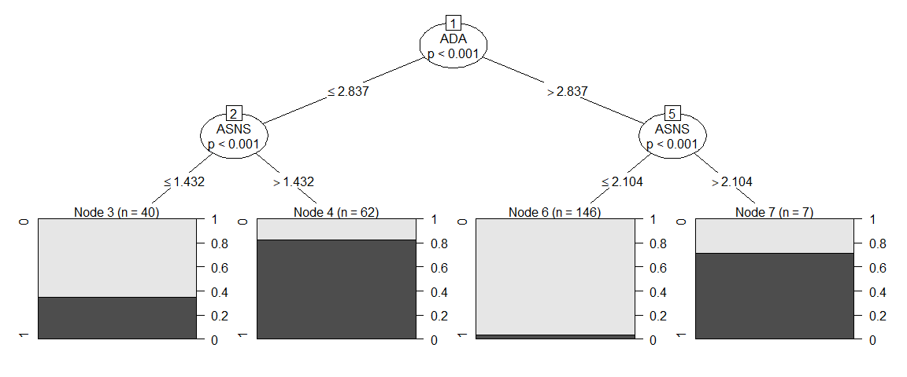
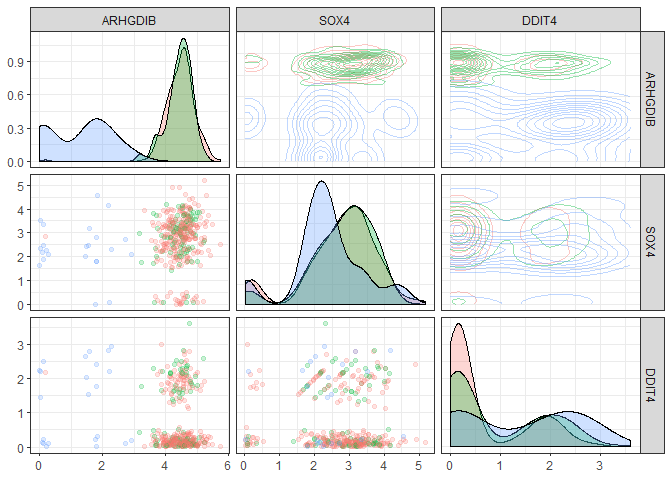

sctree: a package to connect single cell rna-seq to biology using trees
================

  - [sctree](#sctree)
  - [Installation](#installation)
  - [Usage](#usage)
      - [Finding important variables to classify
        clusters](#finding-important-variables-to-classify-clusters)
      - [Visualizing the expected outcome of a flow cytometry
        experiment](#visualizing-the-expected-outcome-of-a-flow-cytometry-experiment)
      - [Suggesting a gating strategy for the
        markers](#suggesting-a-gating-strategy-for-the-markers)
      - [Finding equivalent clusters in two
        datasets](#finding-equivalent-clusters-in-two-datasets)
      - [Finding antibodies for the
        experiment](#finding-antibodies-for-the-experiment)
  - [Reproducing the runs in the purdue
    cluster](#reproducing-the-runs-in-the-purdue-cluster)
  - [Steps down the road](#steps-down-the-road)

<!-- README.md is generated from README.Rmd. Please edit that file -->

# sctree

The goal of sctree is to create a tool to accelerate the transition from
single cell rna-sequencing to calidation and new sub-population
discovery.

Features suggesting pseudo-gating strategies to purify found populations
via flow-cytometry, antibody querying and cross validations between
datasets.

Number of lines in roxygen comments: 586

Number of lines in R code: 980

# Installation

    git clone https://github.rcac.purdue.edu/jpaezpae/sctree sctree
    cd sctree
    
    R -e "devtools::install('.')"

# Usage

I am assuming you have already done your clustering and dimensional
reduction using seurat and we have our seurat object.

For this examples we will use a dummy dataset that come bundled with the
package

`small_5050_mix`, this dataset comes originally from the 1:1 mixture of
Jurkat and 293T cells provided by 10x.

Original data can be found here:

1.  [1:1
    mixture](https://support.10xgenomics.com/single-cell-gene-expression/datasets/1.1.0/jurkat:293t_50:50)
2.  [99:1
    mixture](https://support.10xgenomics.com/single-cell-gene-expression/datasets/1.1.0/jurkat_293t_99_1)

<!-- end list -->

``` r
require(sctree)
#> Loading required package: sctree
require(Seurat)
#> Loading required package: Seurat
#> Loading required package: ggplot2
#> Loading required package: cowplot
#> 
#> Attaching package: 'cowplot'
#> The following object is masked from 'package:ggplot2':
#> 
#>     ggsave
#> Loading required package: Matrix

set.seed(6)

data(small_5050_mix)
small_5050_mix
#> An object of class seurat in project SeuratProject 
#>  1031 genes across 255 samples.

TSNEPlot(small_5050_mix)
```

<!-- -->

## Finding important variables to classify clusters

We base our importances on the “classification value” they give to a
random forest (using the implementation in the `ranger` package)

So lets fit the random forest … Here we are adding the `warn.imp.method`
to prevent a warning message sent by `ranger` when most of the variables
are correlated with the clustering.

Please reffer to the of the `importance_pvalues` section in the [ranger
documentation](https://cran.r-project.org/web/packages/ranger/ranger.pdf)
when addressing this issue and for more details.

``` r
rang_importances <- ranger_importances.seurat(
    small_5050_mix,
    cluster = "ALL",
    warn.imp.method = FALSE)

names(rang_importances)
#> [1] "ranger_fit"                "importances_ranger"       
#> [3] "signif_importances_ranger"
```

This gives us a list with 3 elements.

1.  The ranger fit object itself (handy if you want to inspect its
    classification accuracy)
2.  The importance matrix deriven from ranger
3.  A data frame containing only importances with pvalues under 0.05
    (because biologists love p-values under 0.05)

<!-- end list -->

``` r
rang_importances[[1]]
#> Ranger result
#> 
#> Call:
#>  ranger::ranger(ident ~ ., data = data, num.trees = num.trees,      mtry = floor(ncol(data)/5), importance = importance, ...) 
#> 
#> Type:                             Classification 
#> Number of trees:                  500 
#> Sample size:                      255 
#> Number of independent variables:  140 
#> Mtry:                             28 
#> Target node size:                 1 
#> Variable importance mode:         impurity_corrected 
#> Splitrule:                        gini 
#> OOB prediction error:             18.04 %
```

We can see that our classifier is 18.04 % accurate, as measured by its
*OOB prediction error*.

Your classifier USUALLY will be just as good as your initial clustering
is, therefore if your clustering is not all that consistent to start
with, it is unrealistic that predicions will be done accurately.

Now … taking a look at the importance matrix we can see that a `pvalue`
and a relative importance has been given to each gene.

``` r
head(rang_importances[[2]])
#>                importance     pvalue
#> TNFRSF4       -0.20663582 0.94318182
#> RP3.395M20.12  0.03391993 0.36363636
#> ID3            0.09088435 0.18181818
#> JUN            0.19175235 0.09090909
#> DEPDC1         0.15176841 0.09090909
#> CHI3L2         0.52477223 0.00000000
```

For simplicity we return by default a `data.frame` containing the ones
with `pvalue < 0.05`

``` r
head(rang_importances[[3]])
#>         importance pvalue    gene
#> ASNS      6.350801      0    ASNS
#> CD3D      4.477459      0    CD3D
#> ARHGDIB   4.367260      0 ARHGDIB
#> TMSB4X    4.344165      0  TMSB4X
#> ADA       3.731668      0     ADA
#> MZB1      3.222495      0    MZB1
```

Therefore, in this case we can say that the expression of the following
genes would be usefull to form the clusters.

## Visualizing the expected outcome of a flow cytometry experiment

Lets say we choose the top 5 markers from the former list and we did a
flow experiment … HYPOTHETICALLY the marker distribution would resemble
the rna expression profile for which we have the function
`plot_flowstyle`

``` r
top_markers <- head(rang_importances[[3]]$gene)
top_markers
#> [1] "ASNS"    "CD3D"    "ARHGDIB" "TMSB4X"  "ADA"     "MZB1"
g <- plot_flowstyle(small_5050_mix, markernames = top_markers)
g
```

<!-- -->

Based on this, we can see that the red cluster in this plot is
predominantly CD3+ ADA+ and ARHGDIB+, as well as ASNS-

We can also focus in one of the pannels (and check the color
conventions)

``` r
g[1,2]
```

<!-- -->

## Suggesting a gating strategy for the markers

A general strategy to get separate all clusters

``` r

top_markers <- head(rang_importances[[3]]$gene)

tree_fit <- fit_ctree(small_5050_mix, genes_use = top_markers, cluster = "ALL")
```

Visualizing the tree as … a tree … we can see how our model is a simple
series of yes/no questions.

If we wanted to classifiy a random cell: in the first `node`, we check
if the expression of that gene is higher or lower than a given value, if
it is lower, we proceed to the left, if not we go right. We keep doing
that until we have no more `branches`. This final node will have a
predicted cluster, in this plot we can also see how pure can we expect
this group to be and how many of the cells in our training set clasify
as part of it.

``` r
plot(tree_fit)
```

<!-- -->

When inspecting the tree\_fit, we can see a more detailed text
representation of this tree.

``` r
print(tree_fit)
#> 
#> Model formula:
#> ident ~ ASNS + CD3D + ARHGDIB + TMSB4X + ADA + MZB1
#> 
#> Fitted party:
#> [1] root
#> |   [2] ADA <= 2.83724
#> |   |   [3] ASNS <= 1.43241: 0 (n = 40, err = 35.0%)
#> |   |   [4] ASNS > 1.43241
#> |   |   |   [5] ARHGDIB <= 1.90619: 1 (n = 55, err = 10.9%)
#> |   |   |   [6] ARHGDIB > 1.90619: 0 (n = 7, err = 28.6%)
#> |   [7] ADA > 2.83724
#> |   |   [8] ASNS <= 2.10406: 0 (n = 146, err = 3.4%)
#> |   |   [9] ASNS > 2.10406: 1 (n = 7, err = 28.6%)
#> 
#> Number of inner nodes:    4
#> Number of terminal nodes: 5
```

Sometimes one might think that the proposed strategy is too complicated
or not implementable in the experimental settings, in order to add
constrians to the fit one can give additional arguments that will be
passed to `partykit::ctree_control`, such as `maxdepth = 2` (maximum 2
questions per cell)

``` r
tree_fit <- fit_ctree(
  small_5050_mix, genes_use = top_markers, 
  cluster = "ALL", maxdepth = 2)
print(tree_fit)
#> 
#> Model formula:
#> ident ~ ASNS + CD3D + ARHGDIB + TMSB4X + ADA + MZB1
#> 
#> Fitted party:
#> [1] root
#> |   [2] ADA <= 2.83724
#> |   |   [3] ASNS <= 1.43241: 0 (n = 40, err = 35.0%)
#> |   |   [4] ASNS > 1.43241: 1 (n = 62, err = 17.7%)
#> |   [5] ADA > 2.83724
#> |   |   [6] ASNS <= 2.10406: 0 (n = 146, err = 3.4%)
#> |   |   [7] ASNS > 2.10406: 1 (n = 7, err = 28.6%)
#> 
#> Number of inner nodes:    3
#> Number of terminal nodes: 4
plot(tree_fit)
```

<!-- -->

Since not all variables are ultimately used in our classifier, one can
acces the ones that were by using `varimp(tree_fit)`

``` r
partykit::varimp(tree_fit)
#>       ADA      ASNS 
#> 0.1985014 0.1847596
plot_flowstyle(small_5050_mix, names(partykit::varimp(tree_fit)))
```

<!-- -->

One can also request the package to suggest a specific strategy only for
a given cluster. This function is not expected to give drastically
different results in datasets with few clusters, but it can definitely
come usefull when many clusters are present and one is interested in a
specific
one.

``` r
tree_fit <- fit_ctree(small_5050_mix, genes_use = top_markers, cluster = "0")
print(tree_fit)
#> 
#> Model formula:
#> ident ~ ASNS + CD3D + ARHGDIB + TMSB4X + ADA + MZB1
#> 
#> Fitted party:
#> [1] root
#> |   [2] ADA <= 2.83724
#> |   |   [3] ASNS <= 1.43241: indeed clus 0 (n = 40, err = 35.0%)
#> |   |   [4] ASNS > 1.43241
#> |   |   |   [5] ARHGDIB <= 1.90619: not clus 0 (n = 55, err = 10.9%)
#> |   |   |   [6] ARHGDIB > 1.90619: indeed clus 0 (n = 7, err = 28.6%)
#> |   [7] ADA > 2.83724
#> |   |   [8] ASNS <= 2.10406: indeed clus 0 (n = 146, err = 3.4%)
#> |   |   [9] ASNS > 2.10406: not clus 0 (n = 7, err = 28.6%)
#> 
#> Number of inner nodes:    4
#> Number of terminal nodes: 5
```

## Finding equivalent clusters in two datasets

``` r
data(small_9901_mix)
small_9901_mix
#> An object of class seurat in project SeuratProject 
#>  840 genes across 384 samples.
```

``` r
validation_results <- cross_validate(
    small_5050_mix, small_9901_mix, 
    cluster = "ALL")
#> Warning in ranger::importance_pvalues(ranger_fit): Only few negative
#> importance values found, inaccurate p-values. Consider the 'altmann'
#> approach.

validation_results[[1]]
#> 
#> Model formula:
#> ident ~ JUN + CD1E + MZB1 + HIST1H4C + HIST1H1E + HIST1H1D + 
#>     MYC + CDK1 + UBE2C
#> 
#> Fitted party:
#> [1] root
#> |   [2] MZB1 <= 1.84943
#> |   |   [3] UBE2C <= 2.24257: 0 (n = 36, err = 38.9%)
#> |   |   [4] UBE2C > 2.24257: 1 (n = 64, err = 21.9%)
#> |   [5] MZB1 > 1.84943
#> |   |   [6] HIST1H1E <= 1.52487: 0 (n = 93, err = 2.2%)
#> |   |   [7] HIST1H1E > 1.52487: 0 (n = 62, err = 14.5%)
#> 
#> Number of inner nodes:    3
#> Number of terminal nodes: 4
```

``` r
validation_results$confusion_matrix
#>          cluster
#> predicted   0   1   2
#>         0 261  97   9
#>         1   2   1  14
```

``` r
freq_matrix <- as.frequency.matrix(validation_results$confusion_matrix)
freq_matrix
#>          cluster
#> predicted          0          1          2
#>         0 99.2395437 98.9795918 39.1304348
#>         1  0.7604563  1.0204082 60.8695652
```

This would mean that cells in cluster 0 in the `small_9901_mix` dataset
are classified 99.23 % of the time as bleonging to cluster 0 of the
`small_5050_mix`

These frequencies can be visualized by plotting them in a heatmap

``` r

autoplot.table(freq_matrix,
               min_color = 50,
               show_number = TRUE)
#> Warning: Removed 3 rows containing missing values (geom_text).
```

<!-- -->

Here we can see that in the *9901* dataset (predicted), both clusters 0
and 1 are classified mostrly as cluster 0 in the *5050* dataset, while
the cluster 2 is mainly classified as 1.

(remember that the numbers are arbitrary and only mean something within
each dataset)

``` r
validation_results[[3]]
#> $`0`
#> $`0`$all
#> [1] "MZB1 > 1.84942857412342"
#> 
#> $`0`$majority
#> [1] "HIST1H1E <= 1.52486783772684"
#> 
#> 
#> $`1`
#> $`1`$all
#> [1] "MZB1 <= 1.84942857412342" "UBE2C > 2.24257055439926"
#> 
#> $`1`$majority
#> character(0)
```

``` r
gating_genes <- validation_results$gating_genes
gating_genes
#> [1] "MZB1"     "UBE2C"    "HIST1H1E"
```

``` r
g1 <- plot_flowstyle(small_5050_mix, markernames = gating_genes)
g2 <- plot_flowstyle(small_9901_mix, markernames = gating_genes)
 
g1
```

<!-- -->

``` r
g2
```

<!-- -->

``` r
g2[1,2]
```

<!-- -->

## Finding antibodies for the experiment

Since we acknowledge most experimental workflows need antibodies. We
have implemented several functions to look for antibodies in vendor
websites, as well as some helper functions to find the other posible
aliases a gene might have.

Here is a simple example for a gene widely know to have an antibody
available

``` r
head(query_biocompare_antibodies("CD11b"))
#>                                                                       title
#> 1                                                 Anti-CD11b/ITGAM Antibody
#> 2                                        Anti-CD11b/ITGAM Picoband Antibody
#> 3 Anti-Human CD11b Monoclonal Antibody mFluor450 Conjugated, Flow Validated
#> 4     Anti-CD11b (integrin alpha-M) Rabbit Monoclonal Antibody, Clone#RM290
#> 5                                      Monoclonal Antibody to CD11b (human)
#> 6                                                      Mouse Anti-Rat CD11b
#>            vendor
#> 1       BosterBio
#> 2       BosterBio
#> 3       BosterBio
#> 4       BosterBio
#> 5 MyBioSource.com
#> 6      RayBiotech
#>                                                                                                          specification
#> 1           Applications: Western Blot (WB); Reactivity: Hu, Ms, Rt; Conjugate/Tag: Unconjugated; Quantity: 100ug/vial
#> 2 Applications: WB, FCM, ICC, IHC-fr, IHC-p; Reactivity: Hu, Ms, Rt; Conjugate/Tag: Unconjugated; Quantity: 100ug/vial
#> 3  Applications: Flow Cytometry (FCM); Reactivity: Human (Hu); Conjugate/Tag: mFluor450; Quantity: 25 Tests, 100 Tests
#> 4                          Applications: WB, IHC; Reactivity: Human (Hu); Conjugate/Tag: Unconjugated; Quantity: 100uL
#> 5            Applications: Flow Cytometry (FCM); Reactivity: Human (Hu); Conjugate/Tag: Unconjugated; Quantity: 0.1 mg
#> 6                                           Applications: Flow Cytometry (FCM); Reactivity: Rat (Rt); Quantity: 500 µg
```

``` r
aliases <- get_aliases(gating_genes[[1]])

print(aliases)
#> $MZB1
#> [1] "MEDA-7" "PACAP"  "pERp1"  "MZB1"

lapply(aliases[[1]], function(alias) {
     head(query_biocompare_antibodies(alias))
})
#> [[1]]
#>                                 title               vendor
#> 1            MZB1 Polyclonal Antibody LifeSpan BioSciences
#> 2            MZB1 Polyclonal Antibody LifeSpan BioSciences
#> 3            MZB1 Polyclonal Antibody LifeSpan BioSciences
#> 4            MZB1 Polyclonal Antibody LifeSpan BioSciences
#> 5                 Human MZB1 Antibody             AssayPro
#> 6 Human MZB1 Antibody (APC Conjugate)             AssayPro
#>                                                                                                                specification
#> 1                             Applications: IHC, IHC-p; Reactivity: Human (Hu); Conjugate/Tag: Unconjugated; Quantity: 50 µl
#> 2                                 Applications: ELISA; Reactivity: Human (Hu); Conjugate/Tag: Unconjugated; Quantity: 100 µl
#> 3                        Applications: WB, ELISA, IHC; Reactivity: Human (Hu); Conjugate/Tag: Unconjugated; Quantity: 100 µg
#> 4                      Applications: Western Blot (WB); Reactivity: Human (Hu); Conjugate/Tag: Unconjugated; Quantity: 50 µl
#> 5                            Applications: ELISA, RIA; Reactivity: Human (Hu); Conjugate/Tag: Unconjugated; Quantity: 150 ug
#> 6 Applications: FCM, ICC, IF, IHC; Reactivity: Human (Hu); Conjugate/Tag: Allophycocyanin (APC) conjugated; Quantity: 150 ug
#> 
#> [[2]]
#>                                             title                vendor
#> 1                    PACAP-27 Polyclonal Antibody  LifeSpan BioSciences
#> 2 PRP / PACAP-Related Peptide Polyclonal Antibody  LifeSpan BioSciences
#> 3                       PACAP Polyclonal Antibody  LifeSpan BioSciences
#> 4              PACAP Receptor Polyclonal Antibody Invitrogen Antibodies
#> 5                                  PACAP Antibody       MyBioSource.com
#> 6                          Sheep Anti-Human PACAP            RayBiotech
#>                                                                                         specification
#> 1          Applications: ELISA; Reactivity: Hu, Rt, Sh; Conjugate/Tag: Unconjugated; Quantity: 400 µg
#> 2 Applications: IF, IHC, IHC-fr; Reactivity: Human (Hu); Conjugate/Tag: Unconjugated; Quantity: 50 µl
#> 3          Applications: ELISA; Reactivity: Hu, Rt, Sh; Conjugate/Tag: Unconjugated; Quantity: 100 µg
#> 4          Applications: WB, IHC-p; Reactivity: Ms, Rt; Conjugate/Tag: Unconjugated; Quantity: 100 µL
#> 5                                     Conjugate/Tag: Unconjugated; Quantity: 0.1 mg Affinity-Purified
#> 6                                         Applications: ELISA; Reactivity: Human (Hu); Quantity: 1 ml
#> 
#> [[3]]
#>                                                          title
#> 1                            PERP1 / MZB1 Antibody, Rabbit MAb
#> 2                            PERP1 / MZB1 Antibody, Rabbit MAb
#> 3                            PERP1 / MZB1 Antibody, Rabbit PAb
#> 4 PERP1 / MZB1 Antibody, Rabbit PAb, Antigen Affinity Purified
#> 5                                               PACAP antibody
#> 6                                                    Anti-MZB1
#>                  vendor
#> 1 Sino Biological, Inc.
#> 2 Sino Biological, Inc.
#> 3 Sino Biological, Inc.
#> 4 Sino Biological, Inc.
#> 5       MyBioSource.com
#> 6        MilliporeSigma
#>                                                                                                               specification
#> 1                                 Applications: ELISA; Reactivity: Human (Hu); Conjugate/Tag: Unconjugated; Quantity: 100µL
#> 2 Applications: Immunohistochemistry-paraffin (IHC-p); Reactivity: Human (Hu); Conjugate/Tag: Unconjugated; Quantity: 100µL
#> 3                                 Applications: ELISA; Reactivity: Human (Hu); Conjugate/Tag: Unconjugated; Quantity: 100µL
#> 4                  Applications: WB, ELISA, IHC-p, IP; Reactivity: Human (Hu); Conjugate/Tag: Unconjugated; Quantity: 100µL
#> 5                    Applications: Western Blot (WB); Reactivity: Human (Hu); Conjugate/Tag: Unconjugated; Quantity: 0.1 ml
#> 6                              Applications: WB, IHC; Reactivity: Human (Hu); Conjugate/Tag: Unconjugated; Quantity: 150 UL
#> 
#> [[4]]
#>                                                          title
#> 1                            PERP1 / MZB1 Antibody, Rabbit MAb
#> 2                            PERP1 / MZB1 Antibody, Rabbit MAb
#> 3                            PERP1 / MZB1 Antibody, Rabbit PAb
#> 4 PERP1 / MZB1 Antibody, Rabbit PAb, Antigen Affinity Purified
#> 5                                     MZB1 Polyclonal Antibody
#> 6                                     MZB1 Polyclonal Antibody
#>                  vendor
#> 1 Sino Biological, Inc.
#> 2 Sino Biological, Inc.
#> 3 Sino Biological, Inc.
#> 4 Sino Biological, Inc.
#> 5  LifeSpan BioSciences
#> 6  LifeSpan BioSciences
#>                                                                                                               specification
#> 1                                 Applications: ELISA; Reactivity: Human (Hu); Conjugate/Tag: Unconjugated; Quantity: 100µL
#> 2 Applications: Immunohistochemistry-paraffin (IHC-p); Reactivity: Human (Hu); Conjugate/Tag: Unconjugated; Quantity: 100µL
#> 3                                 Applications: ELISA; Reactivity: Human (Hu); Conjugate/Tag: Unconjugated; Quantity: 100µL
#> 4                  Applications: WB, ELISA, IHC-p, IP; Reactivity: Human (Hu); Conjugate/Tag: Unconjugated; Quantity: 100µL
#> 5                            Applications: IHC, IHC-p; Reactivity: Human (Hu); Conjugate/Tag: Unconjugated; Quantity: 50 µl
#> 6                                Applications: ELISA; Reactivity: Human (Hu); Conjugate/Tag: Unconjugated; Quantity: 100 µl
```

``` r
sessionInfo()
#> R version 3.5.2 (2018-12-20)
#> Platform: x86_64-w64-mingw32/x64 (64-bit)
#> Running under: Windows 10 x64 (build 18356)
#> 
#> Matrix products: default
#> 
#> locale:
#> [1] LC_COLLATE=English_United States.1252 
#> [2] LC_CTYPE=English_United States.1252   
#> [3] LC_MONETARY=English_United States.1252
#> [4] LC_NUMERIC=C                          
#> [5] LC_TIME=English_United States.1252    
#> 
#> attached base packages:
#> [1] stats     graphics  grDevices utils     datasets  methods   base     
#> 
#> other attached packages:
#> [1] Seurat_2.3.4      Matrix_1.2-15     cowplot_0.9.4     ggplot2_3.1.0    
#> [5] sctree_0.0.1.9002
#> 
#> loaded via a namespace (and not attached):
#>   [1] snow_0.4-3           backports_1.1.3      Hmisc_4.2-0         
#>   [4] selectr_0.4-1        wrapr_1.8.6          plyr_1.8.4          
#>   [7] igraph_1.2.4         lazyeval_0.2.2       splines_3.5.2       
#>  [10] digest_0.6.18        foreach_1.4.4        htmltools_0.3.6     
#>  [13] viridis_0.5.1        lars_1.2             gdata_2.18.0        
#>  [16] magrittr_1.5         checkmate_1.9.1      memoise_1.1.0.9000  
#>  [19] cluster_2.0.7-1      mixtools_1.1.0       ROCR_1.0-7          
#>  [22] R.utils_2.8.0        colorspace_1.4-1     blob_1.1.1          
#>  [25] rvest_0.3.2          xfun_0.6             dplyr_0.8.0.1       
#>  [28] crayon_1.3.4         jsonlite_1.6         libcoin_1.0-4       
#>  [31] survival_2.43-3      zoo_1.8-5            iterators_1.0.10    
#>  [34] ape_5.3              glue_1.3.1           gtable_0.3.0        
#>  [37] kernlab_0.9-27       prabclus_2.2-7       BiocGenerics_0.26.0 
#>  [40] DEoptimR_1.0-8       scales_1.0.0         mvtnorm_1.0-10      
#>  [43] DBI_1.0.0            GGally_1.4.0         bibtex_0.4.2        
#>  [46] Rcpp_1.0.1           metap_1.1            dtw_1.20-1          
#>  [49] viridisLite_0.3.0    xtable_1.8-3         htmlTable_1.13.1    
#>  [52] reticulate_1.11.1    foreign_0.8-71       bit_1.1-14          
#>  [55] proxy_0.4-23         mclust_5.4.3         SDMTools_1.1-221    
#>  [58] Formula_1.2-3        stats4_3.5.2         tsne_0.1-3          
#>  [61] DT_0.5               htmlwidgets_1.3      httr_1.4.0          
#>  [64] gplots_3.0.1.1       RColorBrewer_1.1-2   fpc_2.1-11.1        
#>  [67] acepack_1.4.1        modeltools_0.2-22    ica_1.0-2           
#>  [70] pkgconfig_2.0.2      reshape_0.8.8        R.methodsS3_1.7.1   
#>  [73] flexmix_2.3-15       nnet_7.3-12          labeling_0.3        
#>  [76] tidyselect_0.2.5     rlang_0.3.3          reshape2_1.4.3      
#>  [79] later_0.8.0          AnnotationDbi_1.42.1 munsell_0.5.0       
#>  [82] tools_3.5.2          RSQLite_2.1.1        ranger_0.11.2       
#>  [85] ggridges_0.5.1       evaluate_0.13        stringr_1.4.0       
#>  [88] yaml_2.2.0           npsurv_0.4-0         org.Hs.eg.db_3.6.0  
#>  [91] knitr_1.22           bit64_0.9-7          fitdistrplus_1.0-14 
#>  [94] robustbase_0.93-4    caTools_1.17.1.2     purrr_0.3.2         
#>  [97] RANN_2.6.1           pbapply_1.4-0        nlme_3.1-137        
#> [100] mime_0.6             R.oo_1.22.0          xml2_1.2.0          
#> [103] hdf5r_1.1.1          compiler_3.5.2       rstudioapi_0.10     
#> [106] curl_3.3             png_0.1-7            lsei_1.2-0          
#> [109] tibble_2.1.1         stringi_1.4.3        lattice_0.20-38     
#> [112] trimcluster_0.1-2.1  pillar_1.3.1         Rdpack_0.10-1       
#> [115] lmtest_0.9-36        data.table_1.12.0    bitops_1.0-6        
#> [118] irlba_2.3.3          gbRd_0.4-11          httpuv_1.5.0        
#> [121] R6_2.4.0             latticeExtra_0.6-28  promises_1.0.1      
#> [124] KernSmooth_2.23-15   gridExtra_2.3        IRanges_2.14.12     
#> [127] codetools_0.2-15     MASS_7.3-51.1        gtools_3.8.1        
#> [130] assertthat_0.2.1     withr_2.1.2          S4Vectors_0.18.3    
#> [133] diptest_0.75-7       parallel_3.5.2       doSNOW_1.0.16       
#> [136] grid_3.5.2           rpart_4.1-13         tidyr_0.8.3         
#> [139] class_7.3-14         rmarkdown_1.11       inum_1.0-0          
#> [142] segmented_0.5-3.0    Rtsne_0.15           partykit_1.2-3      
#> [145] Biobase_2.40.0       shiny_1.2.0          base64enc_0.1-3
```

# Reproducing the runs in the purdue cluster

To reproduce the runs in the purdue cluster run as follows …

1.  We get the data from the temporary directory

<!-- end list -->

    git clone https://github.rcac.purdue.edu/jpaezpae/data_sctree data
    cd data
    bash untar_data.bash

2.  We run the standard seurat workflow.

This will output a report and generate an .RDS file for each of the
final seurat
    objects

    bash ./bash/build_jobs_seurat_workflow.bash ./data/filtered_matrices_mex_5050/hg19/ mix5050
    bash ./bash/build_jobs_seurat_workflow.bash ./data/filtered_matrices_mex_9901/hg19/ mix9901 

3.  Whenever those are done, run this …

This will run the benchmarks for the datasets. Will also generate 2 .RDS
files containing a list with a lot of stuff in
    it.

    for i in seurat*.RDS ; do bash ./bash/build_jobs_acc_benchmark.bash $i ; done

# Steps down the road

1.  Make figure list.
2.  Address some of the TODO’s in this repository
3.  Reduce dependecies by replacing functions to base equivalents.
4.  Add links to the documentation to make nicer to explore the package
    from inside R
5.  Implement plot that actually illustrates the progressive gating in
    the decision tree
6.  DRASTICALLY increase code coverage (right now everything runs
    without errors due to R CMD check) but expectations are not tested
7.  Implement a way to find markers for clusters exclusively upregulated
