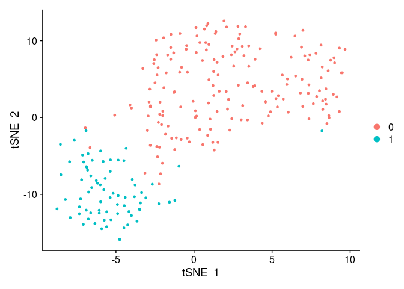
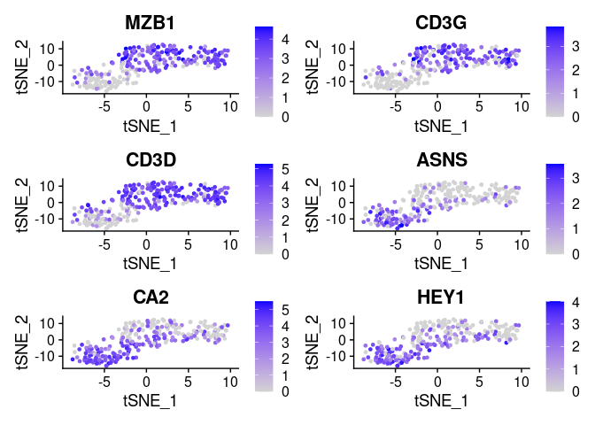
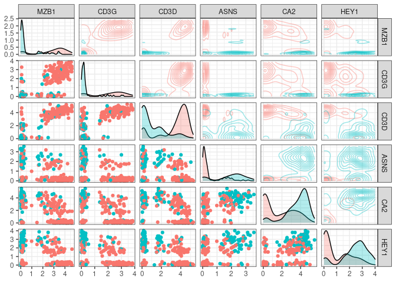
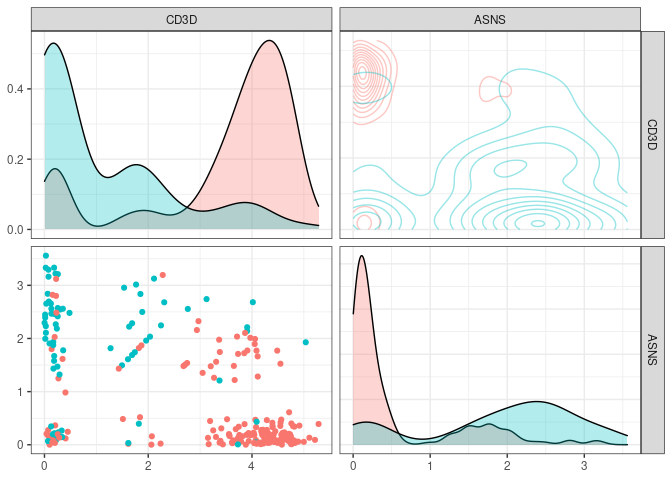

sctree: a package to connect single cell rna-seq to biology using trees
================

<!-- README.md is generated from README.Rmd. Please edit that file -->

[](https://travis-ci.org/jspaezp/sctree)
[](https://codecov.io/github/jspaezp/sctree?branch=master)

# sctree

The goal of sctree is to create a tool to accelerate the transition from
single cell rna-sequencing to calidation and new sub-population
discovery.

Features suggesting pseudo-gating strategies to purify found populations
via flow-cytometry, antibody querying and cross validations between
datasets.

Number of lines in roxygen comments: 1050

Number of lines in R code: 1924

# Installation

    git clone https://github.rcac.purdue.edu/jpaezpae/sctree sctree
    cd sctree
    
    R -e "devtools::install('.')"

# Usage

I am assuming you have already done your clustering and dimensional
reduction using seurat and we have our seurat object.

For this examples we will use a dummy dataset that come bundled with the
package

`small_5050_mix`, this dataset comes originally from the 1:1 mixture of
Jurkat and 293T cells provided by 10x.

Original data can be found here:

1.  [1:1
    mixture](https://support.10xgenomics.com/single-cell-gene-expression/datasets/1.1.0/jurkat:293t_50:50)
2.  [99:1
    mixture](https://support.10xgenomics.com/single-cell-gene-expression/datasets/1.1.0/jurkat_293t_99_1)

<!-- end list -->

``` r
require(sctree)
#> Loading required package: sctree
#> Loading required package: Seurat
#> Registered S3 method overwritten by 'R.oo':
#>   method        from       
#>   throw.default R.methodsS3
#> Registered S3 method overwritten by 'GGally':
#>   method from   
#>   +.gg   ggplot2
#> 
#> Attaching package: 'sctree'
#> The following objects are masked from 'package:Seurat':
#> 
#>     FindAllMarkers, FindConservedMarkers, FindMarkers
require(Seurat)

set.seed(6)

data(small_5050_mix)
small_5050_mix
#> An object of class Seurat 
#> 1031 features across 255 samples within 1 assay 
#> Active assay: RNA (1031 features)
#>  2 dimensional reductions calculated: pca, tsne

DimPlot(small_5050_mix, reduction = "tsne")
```

<!-- -->

## Finding important variables to classify clusters

We base our importances on the “classification value” they give to a
random forest (using the implementation in the `ranger` package)

So lets fit the random forest … Here we are adding the `warn.imp.method`
to prevent a warning message sent by `ranger` when most of the variables
are correlated with the clustering.

Please reffer to the of the `importance_pvalues` section in the [ranger
documentation](https://cran.r-project.org/web/packages/ranger/ranger.pdf)
when addressing this issue and for more details.

``` r
library(sctree)
rang_importances <- ranger_importances.Seurat(
    small_5050_mix,
    cluster = "ALL",
    warn.imp.method = FALSE)
#> Warning: The following arguments are not used: uniq, cells.use
#> Suggested parameter: cells instead of cells.use
```

By default, we obtain a data frame containing only importances with
pvalues under `0.05`.

``` r
head(rang_importances)
#>         importance pvalue    gene
#> ASNS      5.636836      0    ASNS
#> ARHGDIB   4.597722      0 ARHGDIB
#> CD3D      4.466280      0    CD3D
#> TMSB4X    4.450082      0  TMSB4X
#> ADA       3.696396      0     ADA
#> MZB1      3.197148      0    MZB1
```

# Seurat Interface

As an analogous function to Seurat’s `FindAllMarkers`, we offer
`FindAllMarkers_ranger.Seurat`

``` r
markers <- FindAllMarkers_ranger.Seurat(
  small_5050_mix,
  warn.imp.method = FALSE)
#> Warning: The following arguments are not used: uniq, cells.use
#> Suggested parameter: cells instead of cells.use

head(markers)
#>         importance pvalue    gene cluster
#> ASNS      5.685892      0    ASNS       0
#> TMSB4X    5.403575      0  TMSB4X       0
#> ARHGDIB   5.114462      0 ARHGDIB       0
#> ADA       3.853724      0     ADA       0
#> CD3D      3.558077      0    CD3D       0
#> MZB1      3.310409      0    MZB1       0

plot.markers <- do.call(rbind, lapply(split(markers, markers$cluster), head, 3))

FeaturePlot(small_5050_mix, unique(plot.markers$gene))
```

<!-- -->

Note how variable importances can be high if a marker is either
preferentially present of preferentially absent. Therefore as a
pre-filtering step we implemented a modified version of seurat’s
“FindMarkers”

``` r
library(Seurat)
library(sctree)

head(
    sctree::FindMarkers(
        small_5050_mix,
        features = rownames(small_5050_mix@assays$RNA@data),
        ident.1 = 0, test.use = "RangerDE"))
#>         importance p_val    gene avg_logFC pct.1 pct.2 p_val_adj
#> MZB1     0.9641974     0    MZB1  2.004299 0.828 0.227         0
#> CD3G     1.2004702     0    CD3G  1.849551 0.744 0.107         0
#> CD3D     3.2936540     0    CD3D  1.842246 0.872 0.373         0
#> ARHGDIB  2.3889365     0 ARHGDIB  1.787994 0.856 0.320         0
#> AIF1     0.4203789     0    AIF1  1.759311 0.756 0.173         0
#> FYB      0.8291528     0     FYB  1.750418 0.739 0.107         0
```

``` r

markers <- sctree::FindAllMarkers(
        small_5050_mix,
        features = rownames(small_5050_mix@assays$RNA@data),
        test.use = "RangerDE")
#> Calculating cluster 0
#> Calculating cluster 1

# Here we just extract the top 3 markers for each cluster
plot.markers <- do.call(rbind, lapply(split(markers, markers$cluster), head, 3))


plot.markers
#>          importance p_val gene avg_logFC pct.1 pct.2 p_val_adj cluster
#> 0.MZB1    0.9641974     0 MZB1  2.004299 0.828 0.227         0       0
#> 0.CD3G    1.2004702     0 CD3G  1.849551 0.744 0.107         0       0
#> 0.CD3D    3.2936540     0 CD3D  1.842246 0.872 0.373         0       0
#> 1.ASNS.1  3.7143112     0 ASNS  1.428501 0.787 0.217         0       1
#> 1.CA2.1   0.4797642     0  CA2  1.297591 0.933 0.494         0       1
#> 1.HEY1.1  1.1533167     0 HEY1  1.295811 0.893 0.389         0       1
```

## Visualizing the expected outcome of a flow cytometry experiment

Lets say we choose the top n markers from the former list and we did a
flow experiment … HYPOTHETICALLY the marker distribution would resemble
the rna expression profile for which we have the function
`plot_flowstyle`

``` r
top_markers
#> [1] "MZB1" "CD3G" "CD3D" "ASNS" "CA2"  "HEY1"
```

``` r
g <- plot_flowstyle(small_5050_mix, markernames = top_markers)
#> Warning: The following arguments are not used: uniq, cells.use
#> Suggested parameter: cells instead of cells.use
g
```

<!-- -->

We can also focus in one of the pannels (and check the color
conventions)

``` r
g[1,2]
```

<!-- -->

## Suggesting a gating strategy for the markers

A general strategy to get separate all clusters

``` r
top_markers
#> [1] "MZB1" "CD3G" "CD3D" "ASNS" "CA2"  "HEY1"
```

``` r
tree_fit <- fit_ctree(small_5050_mix,
                      genes_use = top_markers,
                      cluster = "ALL")
#> Warning: The following arguments are not used: uniq, cells.use
#> Suggested parameter: cells instead of cells.use
```

Visualizing the tree as … a tree … we can see how our model is a simple
series of yes/no questions.

If we wanted to classifiy a random cell: in the first `node`, we check
if the expression of that gene is higher or lower than a given value, if
it is lower, we proceed to the left, if not we go right. We keep doing
that until we have no more `branches`. This final node will have a
predicted cluster, in this plot we can also see how pure can we expect
this group to be and how many of the cells in our training set clasify
as part of it.

``` r
plot(tree_fit)
```

<!-- -->

When inspecting the tree\_fit, we can see a more detailed text
representation of this tree.

``` r
print(tree_fit)
#> 
#> Model formula:
#> ident ~ MZB1 + CD3G + CD3D + ASNS + CA2 + HEY1
#> 
#> Fitted party:
#> [1] root
#> |   [2] CD3D <= 2.30877
#> |   |   [3] ASNS <= 1.43241: 0 (n = 37, err = 37.8%)
#> |   |   [4] ASNS > 1.43241: 1 (n = 61, err = 16.4%)
#> |   [5] CD3D > 2.30877
#> |   |   [6] ASNS <= 2.10406: 0 (n = 150, err = 3.3%)
#> |   |   [7] ASNS > 2.10406: 1 (n = 7, err = 28.6%)
#> 
#> Number of inner nodes:    3
#> Number of terminal nodes: 4
```

Sometimes one might think that the proposed strategy is too complicated
or not implementable in the experimental settings, in order to add
constrians to the fit one can give additional arguments that will be
passed to `partykit::ctree_control`, such as `maxdepth = 2` (maximum 2
questions per cell)

``` r
tree_fit <- fit_ctree(
    small_5050_mix, genes_use = top_markers,
    cluster = "ALL", maxdepth = 2)
#> Warning: The following arguments are not used: uniq, cells.use
#> Suggested parameter: cells instead of cells.use
print(tree_fit)
#> 
#> Model formula:
#> ident ~ MZB1 + CD3G + CD3D + ASNS + CA2 + HEY1
#> 
#> Fitted party:
#> [1] root
#> |   [2] CD3D <= 2.30877
#> |   |   [3] ASNS <= 1.43241: 0 (n = 37, err = 37.8%)
#> |   |   [4] ASNS > 1.43241: 1 (n = 61, err = 16.4%)
#> |   [5] CD3D > 2.30877
#> |   |   [6] ASNS <= 2.10406: 0 (n = 150, err = 3.3%)
#> |   |   [7] ASNS > 2.10406: 1 (n = 7, err = 28.6%)
#> 
#> Number of inner nodes:    3
#> Number of terminal nodes: 4
plot(tree_fit)
```

<!-- -->

Since not all variables are ultimately used in our classifier, one can
acces the ones that were by using `varimp(tree_fit)`

``` r
partykit::varimp(tree_fit)
#>      CD3D      ASNS 
#> 0.2849840 0.1505534
plot_flowstyle(small_5050_mix, names(partykit::varimp(tree_fit)))
#> Warning: The following arguments are not used: uniq, cells.use
#> Suggested parameter: cells instead of cells.use
```

<!-- -->

One can also request the package to suggest a specific strategy only for
a given cluster. This function is not expected to give drastically
different results in datasets with few clusters, but it can definitely
come usefull when many clusters are present and one is interested in a
specific
one.

``` r
tree_fit <- fit_ctree(small_5050_mix, genes_use = top_markers, cluster = "0")
#> Warning: The following arguments are not used: uniq, cells.use
#> Suggested parameter: cells instead of cells.use
print(tree_fit)
#> 
#> Model formula:
#> ident ~ MZB1 + CD3G + CD3D + ASNS + CA2 + HEY1
#> 
#> Fitted party:
#> [1] root
#> |   [2] CD3D <= 2.30877
#> |   |   [3] ASNS <= 1.43241: clus 0 (n = 37, err = 37.8%)
#> |   |   [4] ASNS > 1.43241: not clus 0 (n = 61, err = 16.4%)
#> |   [5] CD3D > 2.30877
#> |   |   [6] ASNS <= 2.10406: clus 0 (n = 150, err = 3.3%)
#> |   |   [7] ASNS > 2.10406: not clus 0 (n = 7, err = 28.6%)
#> 
#> Number of inner nodes:    3
#> Number of terminal nodes: 4
```

Sometimes it is useful to visualize directly the subset of cells that
will be “gated” out in each rule, this can be easily achieved by using
our implementation of `plot_gates`

``` r
plot_gates(small_5050_mix, tree_fit, "6")
#> Warning: The following arguments are not used: uniq, cells.use
#> Suggested parameter: cells instead of cells.use
```

<!-- -->

We have also implemented a way to export these rules as a `garnett`
classifier. for more detail on how the calssifier is implemented please
refer to [the garnett
documentation](https://cole-trapnell-lab.github.io/garnett/docs/#constructing-a-marker-file)

``` r
as.garnett(tree_fit)
#> > clus 0_node_3  (n = 37)
#> expressed below: ASNS 1.432, CD3D 2.309
#> 
#> > clus 0_node_6  (n = 150)
#> expressed above: CD3D 2.309
#> expressed below: ASNS 2.104
#> 
#> > not clus 0_node_4  (n = 61)
#> expressed above: ASNS 1.432
#> expressed below: CD3D 2.309
#> 
#> > not clus 0_node_7  (n = 7)
#> expressed above: ASNS 2.104, CD3D 2.309
```

## Finding antibodies for the experiment

Since we acknowledge most experimental workflows need antibodies. We
have implemented several functions to look for antibodies in vendor
websites, as well as some helper functions to find the other posible
aliases a gene might have.

Here is a simple example for a gene widely know to have an antibody
available

``` r
require(sctree)
head(query_biocompare_antibodies("CD11b"))
#>                                   title            vendor
#> 1         Anti-CD11b antibody [EPR1344]             Abcam
#> 2             Anti-CD11b/ITGAM Antibody         BosterBio
#> 3    Anti-CD11b/ITGAM Picoband Antibody         BosterBio
#> 4 Anti-CD11b Rabbit Monoclonal Antibody         BosterBio
#> 5  Monoclonal Antibody to CD11b (human)   MyBioSource.com
#> 6                Anti-CD11b (Mouse) mAb MBL International
#>                                                                                                            specification
#> 1 Applications: WB, IHC-p; Reactivity: Hu, Ms, Rt, Pg, RhMk; Conjugate/Tag: Unconjugated; Quantity: 10 µl, 40 µl, 100 µl
#> 2             Applications: Western Blot (WB); Reactivity: Hu, Ms, Rt; Conjugate/Tag: Unconjugated; Quantity: 100ug/vial
#> 3   Applications: WB, FCM, ICC, IHC-fr, IHC-p; Reactivity: Hu, Ms, Rt; Conjugate/Tag: Unconjugated; Quantity: 100ug/vial
#> 4                       Applications: WB, IF, IHC; Reactivity: Hu, Ms; Conjugate/Tag: Unconjugated; Quantity: 100ug/vial
#> 5              Applications: Flow Cytometry (FCM); Reactivity: Human (Hu); Conjugate/Tag: Unconjugated; Quantity: 0.1 mg
#> 6              Applications: Flow Cytometry (FCM); Reactivity: Mouse (Ms); Conjugate/Tag: Unconjugated; Quantity: 100 ug
```

``` r
sessionInfo()
#> R version 3.6.0 (2019-04-26)
#> Platform: x86_64-redhat-linux-gnu (64-bit)
#> Running under: Fedora 30 (Workstation Edition)
#> 
#> Matrix products: default
#> BLAS/LAPACK: /usr/lib64/R/lib/libRblas.so
#> 
#> locale:
#>  [1] LC_CTYPE=en_US.UTF-8       LC_NUMERIC=C              
#>  [3] LC_TIME=en_US.UTF-8        LC_COLLATE=en_US.UTF-8    
#>  [5] LC_MONETARY=en_US.UTF-8    LC_MESSAGES=en_US.UTF-8   
#>  [7] LC_PAPER=en_US.UTF-8       LC_NAME=C                 
#>  [9] LC_ADDRESS=C               LC_TELEPHONE=C            
#> [11] LC_MEASUREMENT=en_US.UTF-8 LC_IDENTIFICATION=C       
#> 
#> attached base packages:
#> [1] stats     graphics  grDevices utils     datasets  methods   base     
#> 
#> other attached packages:
#> [1] sctree_0.0.4.0002 Seurat_3.1.0     
#> 
#> loaded via a namespace (and not attached):
#>   [1] Rtsne_0.15           colorspace_1.4-1     selectr_0.4-1       
#>   [4] ggridges_0.5.1       leiden_0.3.1         listenv_0.7.0       
#>   [7] npsurv_0.4-0         ggrepel_0.8.1        bit64_0.9-7         
#>  [10] AnnotationDbi_1.46.1 mvtnorm_1.0-11       xml2_1.2.2          
#>  [13] ranger_0.11.2        codetools_0.2-16     splines_3.6.0       
#>  [16] R.methodsS3_1.7.1    lsei_1.2-0           libcoin_1.0-5       
#>  [19] knitr_1.24           zeallot_0.1.0        Formula_1.2-3       
#>  [22] jsonlite_1.6         ica_1.0-2            cluster_2.0.8       
#>  [25] png_0.1-7            R.oo_1.22.0          uwot_0.1.3          
#>  [28] sctransform_0.2.0    compiler_3.6.0       httr_1.4.1          
#>  [31] backports_1.1.4      assertthat_0.2.1     Matrix_1.2-17       
#>  [34] lazyeval_0.2.2       htmltools_0.3.6      tools_3.6.0         
#>  [37] rsvd_1.0.2           igraph_1.2.4.1       partykit_1.2-5      
#>  [40] gtable_0.3.0         glue_1.3.1           RANN_2.6.1          
#>  [43] reshape2_1.4.3       dplyr_0.8.3          Rcpp_1.0.2          
#>  [46] Biobase_2.44.0       vctrs_0.2.0          gdata_2.18.0        
#>  [49] ape_5.3              nlme_3.1-139         gbRd_0.4-11         
#>  [52] lmtest_0.9-37        inum_1.0-1           xfun_0.9            
#>  [55] stringr_1.4.0        globals_0.12.4       rvest_0.3.4         
#>  [58] irlba_2.3.3          gtools_3.8.1         future_1.14.0       
#>  [61] MASS_7.3-51.4        zoo_1.8-6            scales_1.0.0        
#>  [64] parallel_3.6.0       RColorBrewer_1.1-2   curl_4.0            
#>  [67] yaml_2.2.0           memoise_1.1.0        reticulate_1.13     
#>  [70] pbapply_1.4-2        gridExtra_2.3        ggplot2_3.2.1       
#>  [73] rpart_4.1-15         reshape_0.8.8        stringi_1.4.3       
#>  [76] RSQLite_2.1.2        S4Vectors_0.22.1     caTools_1.17.1.2    
#>  [79] BiocGenerics_0.30.0  bibtex_0.4.2         Rdpack_0.11-0       
#>  [82] SDMTools_1.1-221.1   rlang_0.4.0          pkgconfig_2.0.2     
#>  [85] bitops_1.0-6         evaluate_0.14        lattice_0.20-38     
#>  [88] ROCR_1.0-7           purrr_0.3.2          labeling_0.3        
#>  [91] htmlwidgets_1.3      cowplot_1.0.0        bit_1.1-14          
#>  [94] tidyselect_0.2.5     GGally_1.4.0         RcppAnnoy_0.0.12    
#>  [97] wrapr_1.8.9          plyr_1.8.4           magrittr_1.5        
#> [100] R6_2.4.0             IRanges_2.18.2       gplots_3.0.1.1      
#> [103] DBI_1.0.0            pillar_1.4.2         fitdistrplus_1.0-14 
#> [106] survival_2.44-1.1    tibble_2.1.3         future.apply_1.3.0  
#> [109] tsne_0.1-3           crayon_1.3.4         KernSmooth_2.23-15  
#> [112] plotly_4.9.0         rmarkdown_1.15       viridis_0.5.1       
#> [115] grid_3.6.0           data.table_1.12.2    blob_1.2.0          
#> [118] metap_1.1            digest_0.6.20        tidyr_0.8.3         
#> [121] R.utils_2.9.0        RcppParallel_4.4.3   stats4_3.6.0        
#> [124] munsell_0.5.0        viridisLite_0.3.0
```

# Steps down the road

3.  Address some of the TODO’s in this repository
4.  Reduce dependecies by replacing functions to base equivalents.
5.  Add links to the documentation to make nicer to explore the package
    from inside R
6.  Implement plot that actually illustrates the progressive gating in
    the decision tree
7.  Implement a way to find markers for clusters exclusively upregulated
8.  Refctor the code to make the coding nomenclature same as seurat
