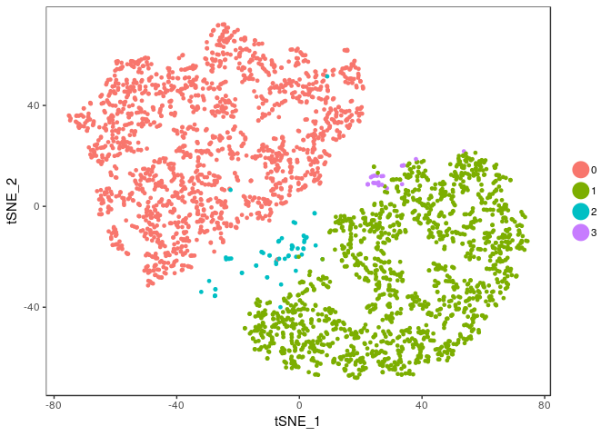
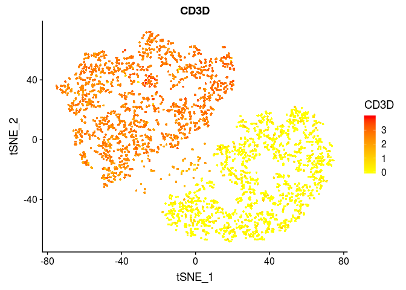
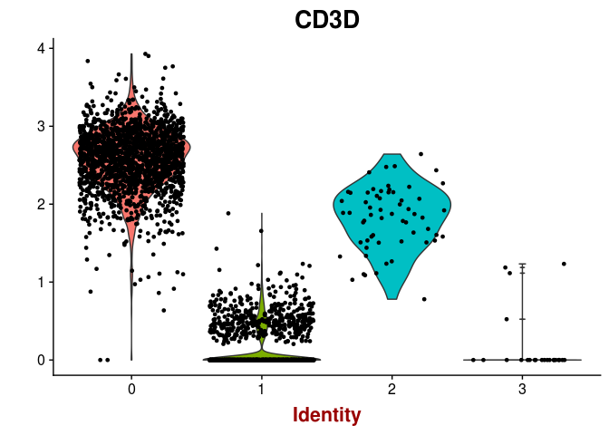
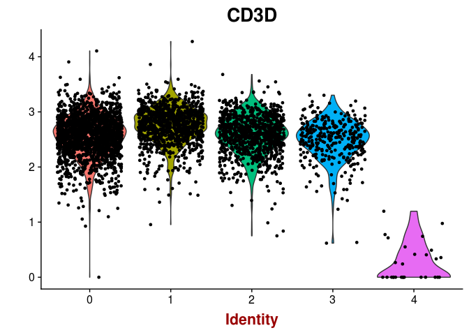
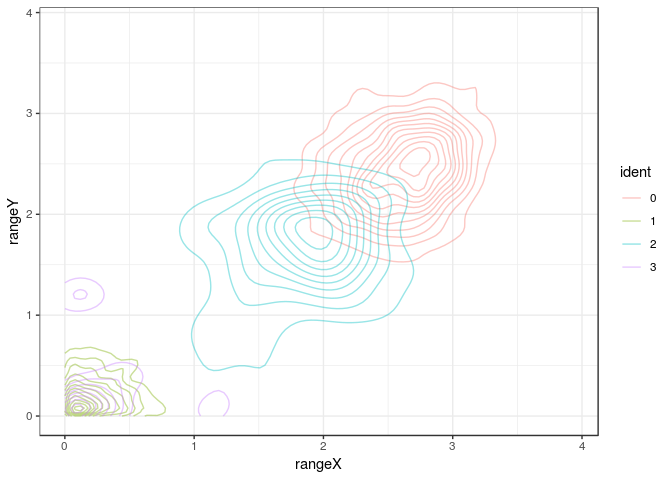
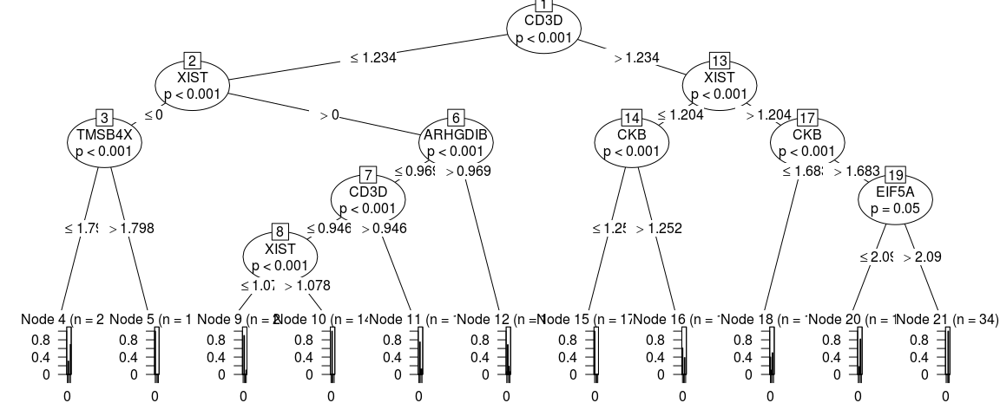
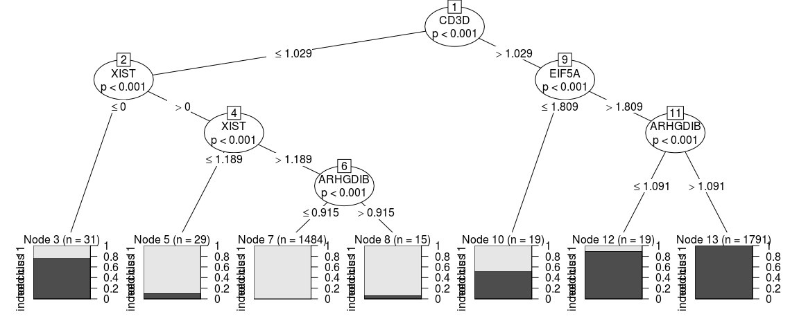
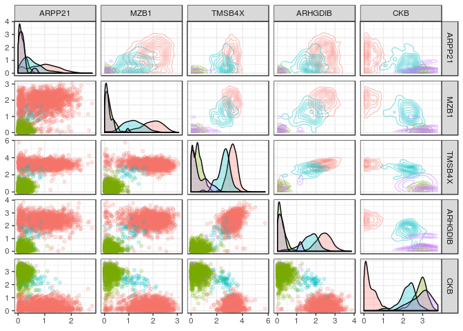
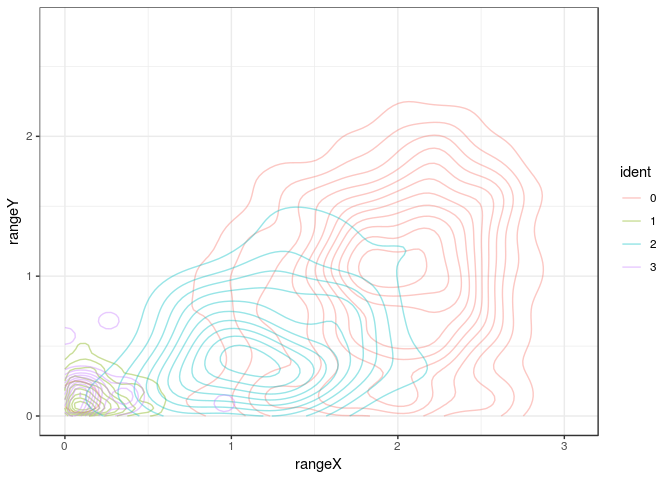
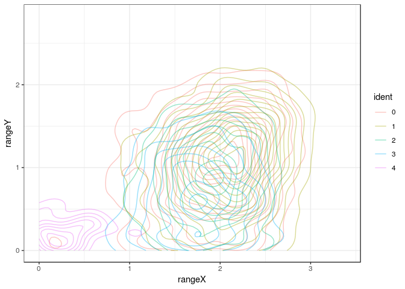

sctree: a package to connect single cell rna-seq to biology using trees
================

# Usage

I am assuming you have already done your clustering and dimensional
reduction using seurat and we have our seurat object (here we will use a
sub-sampled data set)

``` r
require(sctree)
```

    ## Loading required package: sctree

    ## 
    ## Attaching package: 'sctree'

    ## The following object is masked _by_ '.GlobalEnv':
    ## 
    ##     cross_validate

``` r
require(Seurat)
```

    ## Loading required package: Seurat

    ## Loading required package: ggplot2

    ## Loading required package: cowplot

    ## 
    ## Attaching package: 'cowplot'

    ## The following object is masked from 'package:ggplot2':
    ## 
    ##     ggsave

    ## Loading required package: Matrix

``` r
set.seed(6)

seurat_mix5050 <- readRDS("seurat_mix5050.RDS")
seurat_mix9901 <- readRDS("seurat_mix9901.RDS")

TSNEPlot(seurat_mix9901)
```

<!-- -->

``` r
TSNEPlot(seurat_mix5050)
```

<!-- -->

Due to prior knowledge we know that Jurkat cells express CD3D but lets
try to get to that knowledge using our package …

``` r
FeaturePlot(seurat_mix9901, "CD3D", no.legend = FALSE)
```

<!-- -->

``` r
FeaturePlot(seurat_mix5050, "CD3D", no.legend = FALSE)
```

<!-- -->

``` r
VlnPlot(seurat_mix5050, "CD3D")
```

<!-- -->

``` r
VlnPlot(seurat_mix9901, "CD3D")
```

<!-- -->

## Finding important variables to classify clusters

We base our importances on the “classification value” they give to a
random forest (using the implementation in the `ranger` package)

So lets fit the random forest
…

``` r
rang_importances <- ranger_importances.seurat(seurat_mix5050, cluster = "ALL")
```

    ## ranger.seurat being called

``` r
names(rang_importances)
```

    ## [1] "ranger_fit"                "importances_ranger"       
    ## [3] "signif_importances_ranger"

This gives us a list with 3 elements.

1.  The ranger fit object itself (handy if you want to inspect its
    classification accuracy)
2.  The importance matrix deriven from ranger
3.  A data frame containing only importances with pvalues under 0.05
    (because biologists love p-values under 0.05)

<!-- end list -->

``` r
rang_importances[[1]]
```

    ## Ranger result
    ## 
    ## Call:
    ##  ranger::ranger(ident ~ ., data = data, num.trees = num.trees,      mtry = floor(ncol(data)/5), importance = importance, ...) 
    ## 
    ## Type:                             Classification 
    ## Number of trees:                  500 
    ## Sample size:                      3388 
    ## Number of independent variables:  538 
    ## Mtry:                             107 
    ## Target node size:                 1 
    ## Variable importance mode:         impurity_corrected 
    ## Splitrule:                        gini 
    ## OOB prediction error:             0.27 %

We can see that our classifier is not all that great in this case, 0.27
% as measured by its *OOB prediction error* (since the clustering is not
great to start with …)

``` r
head(rang_importances[[2]])
```

    ##                importance      pvalue
    ## HES4           0.95605378 0.000000000
    ## ISG15          9.38674714 0.000000000
    ## TNFRSF4        0.06175905 0.004545455
    ## RP3.395M20.12 -0.02906475 0.968181818
    ## KCNAB2         0.04887938 0.009090909
    ## CTNNBIP1      -0.03134780 0.977272727

``` r
head(rang_importances[[3]])
```

    ##         importance pvalue    gene
    ## ARHGDIB   151.8484      0 ARHGDIB
    ## CD3D      149.1117      0    CD3D
    ## EIF5A     142.6936      0   EIF5A
    ## TMSB4X    139.7299      0  TMSB4X
    ## XIST      121.9769      0    XIST
    ## CKB       117.8999      0     CKB

## Visualizing the expected outcome of a flow cutometry experiment

Lets say we choose the top 5 markers from the former list and we did a
flow experiment … HYPOTHETICALLY the marker distribution would resemble
the rna expression profile for which we have the function
`plot_flowstyle`

``` r
top_markers <- head(rang_importances[[3]]$gene)
top_markers
```

    ## [1] "ARHGDIB" "CD3D"    "EIF5A"   "TMSB4X"  "XIST"    "CKB"

``` r
g <- plot_flowstyle(seurat_mix5050, markernames = top_markers)
g
```

<!-- -->

We can also focus in one of the pannels (and check the color
conventions)

``` r
g[1,2]
```

<!-- -->

## Suggesting a gating strategy for the markers

A general strategy to get separate all
clusters

``` r
rang_importances <- ranger_importances.seurat(seurat_mix5050, cluster = "ALL")
```

    ## ranger.seurat being called

    ## Warning in ranger::importance_pvalues(ranger_fit): Only few negative
    ## importance values found, inaccurate p-values. Consider the 'altmann'
    ## approach.

``` r
top_markers <- head(rang_importances[[3]]$gene)

tree_fit <- fit_ctree(seurat_mix5050, genes_use = top_markers, cluster = "ALL")

print(tree_fit)
```

    ## 
    ## Model formula:
    ## ident ~ CKB + TMSB4X + CD3D + ARHGDIB + XIST + EIF5A
    ## 
    ## Fitted party:
    ## [1] root
    ## |   [2] CD3D <= 1.23381
    ## |   |   [3] XIST <= 0
    ## |   |   |   [4] TMSB4X <= 1.79846: 3 (n = 26, err = 30.8%)
    ## |   |   |   [5] TMSB4X > 1.79846: 0 (n = 13, err = 0.0%)
    ## |   |   [6] XIST > 0
    ## |   |   |   [7] ARHGDIB <= 0.96865
    ## |   |   |   |   [8] CD3D <= 0.94553
    ## |   |   |   |   |   [9] XIST <= 1.07836: 1 (n = 20, err = 10.0%)
    ## |   |   |   |   |   [10] XIST > 1.07836: 1 (n = 1490, err = 0.0%)
    ## |   |   |   |   [11] CD3D > 0.94553: 1 (n = 16, err = 25.0%)
    ## |   |   |   [12] ARHGDIB > 0.96865: 1 (n = 16, err = 31.2%)
    ## |   [13] CD3D > 1.23381
    ## |   |   [14] XIST <= 1.20355
    ## |   |   |   [15] CKB <= 1.25151: 0 (n = 1734, err = 0.0%)
    ## |   |   |   [16] CKB > 1.25151: 0 (n = 18, err = 38.9%)
    ## |   |   [17] XIST > 1.20355
    ## |   |   |   [18] CKB <= 1.68252: 2 (n = 10, err = 50.0%)
    ## |   |   |   [19] CKB > 1.68252
    ## |   |   |   |   [20] EIF5A <= 2.09015: 2 (n = 11, err = 18.2%)
    ## |   |   |   |   [21] EIF5A > 2.09015: 2 (n = 34, err = 0.0%)
    ## 
    ## Number of inner nodes:    10
    ## Number of terminal nodes: 11

Visualizing the tree as … a tree …

``` r
plot(tree_fit)
```

<!-- -->

Sometimes one might think that the proposed strategy is too complicated
or not implementable in the experimental settings, in order to add
constrins to the fit one can give additional arguments that will be
passed to `partykit::ctree_control`, such as `maxdepth = 2`

``` r
tree_fit <- fit_ctree(
  seurat_mix5050, genes_use = top_markers, 
  cluster = "ALL", maxdepth = 2)
print(tree_fit)
```

    ## 
    ## Model formula:
    ## ident ~ CKB + TMSB4X + CD3D + ARHGDIB + XIST + EIF5A
    ## 
    ## Fitted party:
    ## [1] root
    ## |   [2] CD3D <= 1.23381
    ## |   |   [3] XIST <= 0: 3 (n = 39, err = 53.8%)
    ## |   |   [4] XIST > 0: 1 (n = 1542, err = 0.7%)
    ## |   [5] CD3D > 1.23381
    ## |   |   [6] XIST <= 1.20355: 0 (n = 1752, err = 0.4%)
    ## |   |   [7] XIST > 1.20355: 2 (n = 55, err = 12.7%)
    ## 
    ## Number of inner nodes:    3
    ## Number of terminal nodes: 4

``` r
plot(tree_fit)
```

<!-- -->

Since not all variables are ultimately used in our classifier, one can
acces the ones that were by using `varimp(tree_fit)`

``` r
partykit::varimp(tree_fit)
```

    ##      CD3D      XIST 
    ## 1.3955060 0.1890892

``` r
plot_flowstyle(seurat_mix5050, names(partykit::varimp(tree_fit)))
```

<!-- -->

A specific strategy only for cluster
1

``` r
tree_fit <- fit_ctree(seurat_mix5050, genes_use = top_markers, cluster = "1")

print(tree_fit)
```

    ## 
    ## Model formula:
    ## ident ~ CKB + TMSB4X + CD3D + ARHGDIB + XIST + EIF5A
    ## 
    ## Fitted party:
    ## [1] root
    ## |   [2] CD3D <= 1.0286
    ## |   |   [3] XIST <= 0: not clus 1 (n = 31, err = 22.6%)
    ## |   |   [4] XIST > 0
    ## |   |   |   [5] XIST <= 1.18927: indeed clus 1 (n = 29, err = 10.3%)
    ## |   |   |   [6] XIST > 1.18927
    ## |   |   |   |   [7] ARHGDIB <= 0.91505: indeed clus 1 (n = 1484, err = 0.0%)
    ## |   |   |   |   [8] ARHGDIB > 0.91505: indeed clus 1 (n = 15, err = 6.7%)
    ## |   [9] CD3D > 1.0286
    ## |   |   [10] EIF5A <= 1.80929: not clus 1 (n = 19, err = 47.4%)
    ## |   |   [11] EIF5A > 1.80929
    ## |   |   |   [12] ARHGDIB <= 1.09133: not clus 1 (n = 19, err = 10.5%)
    ## |   |   |   [13] ARHGDIB > 1.09133: not clus 1 (n = 1791, err = 0.0%)
    ## 
    ## Number of inner nodes:    6
    ## Number of terminal nodes: 7

Visualizing the tree as … a tree …

``` r
plot(tree_fit)
```

<!-- -->

## Finding equivalent clusters in two datasets

``` r
validation_results <- cross_validate(
    seurat_mix5050, seurat_mix9901, 
    cluster = "1")
```

    ## ranger.seurat being called

<!-- -->

``` r
validation_results[[1]]
```

    ## 
    ## Model formula:
    ## ident ~ HES4 + TNFRSF4 + C1orf63 + SH3BGRL3 + CDC20 + JUN + CHI3L2 + 
    ##     MLLT11 + CD1B + CD1E + ARHGAP30 + SELL + MIR181A1HG + CENPF + 
    ##     RRM2 + TMSB10 + CAPG + GYPC + MYO7B + CXCR4 + ITGA4 + SGOL2 + 
    ##     ARPP21 + TFDP2 + RFC4 + SH3TC1 + RHOH + LEF1 + HHIP.AS1 + 
    ##     FYB + CCNB1 + TCF7 + MZB1 + TAF7 + PTTG1 + SOX4 + HIST1H4C + 
    ##     PPP1R18 + GPSM3 + ACAT2 + MYO1G + RBM48 + AC002454.1 + GIMAP7 + 
    ##     PAXIP1.AS1 + TMSB4X + PLP2 + IL2RG + PGK1 + ITM2A + PGRMC1 + 
    ##     SH2D1A + PBK + EIF4EBP1 + MYC + DNAJA1 + PSAT1 + HSPA5 + 
    ##     TUBB4B + VIM + CDK1 + ARID5B + DNTT + ADD3 + FTH1 + RASGRP2 + 
    ##     NEAT1 + MALAT1 + PTPRCAP + CORO1B + HSPA8 + C12orf57 + ARHGDIB + 
    ##     TUBA1A + HSP90B1 + UBC + KIAA0226L + HSP90AA1 + CKB + CCNB2 + 
    ##     IDH2 + CORO1A + HERPUD1 + KPNA2 + ACTG1 + RAC3 + TYMS + LDLRAD4 + 
    ##     PMAIP1 + PCNA + CALR + CD79A + EMP3 + FTL + IGLL1 + CHCHD10 + 
    ##     XBP1 + GTSE1 + MT.CO1 + MT.CO3
    ## 
    ## Fitted party:
    ## [1] root
    ## |   [2] TMSB4X <= 1.77781
    ## |   |   [3] MT.CO1 <= 1.63988: not clus 1 (n = 21, err = 0.0%)
    ## |   |   [4] MT.CO1 > 1.63988
    ## |   |   |   [5] ARPP21 <= 0.51876
    ## |   |   |   |   [6] MZB1 <= 0.70991: indeed clus 1 (n = 1503, err = 0.0%)
    ## |   |   |   |   [7] MZB1 > 0.70991: indeed clus 1 (n = 25, err = 16.0%)
    ## |   |   |   [8] ARPP21 > 0.51876: indeed clus 1 (n = 16, err = 31.2%)
    ## |   [9] TMSB4X > 1.77781
    ## |   |   [10] ARHGDIB <= 1.03802: not clus 1 (n = 19, err = 31.6%)
    ## |   |   [11] ARHGDIB > 1.03802
    ## |   |   |   [12] CKB <= 2.30453: not clus 1 (n = 1780, err = 0.0%)
    ## |   |   |   [13] CKB > 2.30453: not clus 1 (n = 24, err = 4.2%)
    ## 
    ## Number of inner nodes:    6
    ## Number of terminal nodes: 7

``` r
validation_results$summary_table
```

    ##        predicted
    ## cluster indeed clus 1   not clus 1
    ##       0    0.11025358  99.88974642
    ##       1    0.09345794  99.90654206
    ##       2    0.00000000 100.00000000
    ##       3    0.00000000 100.00000000
    ##       4   89.28571429  10.71428571

``` r
cluster_prediction <- as.data.frame(validation_results[[2]])

validation_results[[3]]
```

    ## $`indeed clus 1`
    ## $`indeed clus 1`$all
    ## [1] "TMSB4X <= 1.7778059638159" "MT.CO1 > 1.6398796706598" 
    ## 
    ## $`indeed clus 1`$majority
    ## [1] "ARPP21 <= 0.518763033375047" "MZB1 <= 0.709908638093719"  
    ## 
    ## 
    ## $`not clus 1`
    ## $`not clus 1`$all
    ## [1] "TMSB4X > 1.7778059638159"
    ## 
    ## $`not clus 1`$majority
    ## [1] "ARHGDIB > 1.03801957968406" "CKB <= 2.3045288282798"

``` r
gating_genes <- validation_results$gating_genes
gating_genes
```

    ## [1] "TMSB4X"  "MT.CO1"  "ARPP21"  "MZB1"    "ARHGDIB" "CKB"

``` r
g1 <- plot_flowstyle(seurat_mix5050, 
                     markernames = seurat_mix5050@var.genes[seurat_mix5050@var.genes %in% gating_genes])
g2 <- plot_flowstyle(seurat_mix9901, 
                     markernames = seurat_mix9901@var.genes[seurat_mix9901@var.genes %in% gating_genes])
 
g1
```

<!-- -->

``` r
g2
```

<!-- -->

``` r
g1[1,2]
```

<!-- -->

``` r
g2[1,2]
```

<!-- -->

## Finding antibodies for the experiment

Since we acknowledge most experimental workflows need antibodies. We
have implemented several functions to look for antibodies in vendor
websites, as well as some helper functions to find the other posible
aliases a gene might have.

``` r
aliases <- get_aliases(gating_genes[[1]])

print(aliases)
```

    ## $TMSB4X
    ## [1] "FX"     "PTMB4"  "TB4X"   "TMSB4"  "TMSB4X"

``` r
lapply(aliases[[1]], function(alias) {
  list(query_biolegend_antibodies(alias),
       query_sc_antibodies(alias))
})
```

    ## [[1]]
    ## [[1]][[1]]
    ## character(0)
    ## 
    ## [[1]][[2]]
    ##               Product_Name   Cat_num Epitope              Species
    ## 5 T beta-10 Antibody (D-6) sc-514309   Tβ-10 mouse, rat and human
    ##                 Method
    ## 5 WB, IP, IF and ELISA
    ## 
    ## 
    ## [[2]]
    ## [[2]][[1]]
    ## character(0)
    ## 
    ## [[2]][[2]]
    ##               Product_Name   Cat_num Epitope              Species
    ## 1 T beta-10 Antibody (D-6) sc-514309   Tβ-10 mouse, rat and human
    ##                 Method
    ## 1 WB, IP, IF and ELISA
    ## 
    ## 
    ## [[3]]
    ## [[3]][[1]]
    ## character(0)
    ## 
    ## [[3]][[2]]
    ##               Product_Name   Cat_num Epitope              Species
    ## 1 T beta-10 Antibody (D-6) sc-514309   Tβ-10 mouse, rat and human
    ##                 Method
    ## 1 WB, IP, IF and ELISA
    ## 
    ## 
    ## [[4]]
    ## [[4]][[1]]
    ## character(0)
    ## 
    ## [[4]][[2]]
    ##               Product_Name   Cat_num Epitope              Species
    ## 1 T beta-10 Antibody (D-6) sc-514309   Tβ-10 mouse, rat and human
    ##                 Method
    ## 1 WB, IP, IF and ELISA
    ## 
    ## 
    ## [[5]]
    ## [[5]][[1]]
    ## character(0)
    ## 
    ## [[5]][[2]]
    ## NULL

``` r
sessionInfo()
```

    ## R version 3.5.2 (2018-12-20)
    ## Platform: x86_64-pc-linux-gnu (64-bit)
    ## Running under: CentOS Linux 7 (Core)
    ## 
    ## Matrix products: default
    ## BLAS: /home/jpaezpae/opt/R-3.5.2/lib/libRblas.so
    ## LAPACK: /home/jpaezpae/opt/R-3.5.2/lib/libRlapack.so
    ## 
    ## locale:
    ##  [1] LC_CTYPE=en_US.UTF-8 LC_NUMERIC=C         LC_TIME=C           
    ##  [4] LC_COLLATE=C         LC_MONETARY=C        LC_MESSAGES=C       
    ##  [7] LC_PAPER=C           LC_NAME=C            LC_ADDRESS=C        
    ## [10] LC_TELEPHONE=C       LC_MEASUREMENT=C     LC_IDENTIFICATION=C 
    ## 
    ## attached base packages:
    ## [1] stats     graphics  grDevices utils     datasets  methods   base     
    ## 
    ## other attached packages:
    ## [1] Seurat_2.3.4      Matrix_1.2-15     cowplot_0.9.4     ggplot2_3.1.0    
    ## [5] sctree_0.0.1.9001
    ## 
    ## loaded via a namespace (and not attached):
    ##   [1] snow_0.4-3           backports_1.1.3      Hmisc_4.2-0         
    ##   [4] selectr_0.4-1        wrapr_1.8.5          plyr_1.8.4          
    ##   [7] igraph_1.2.4         lazyeval_0.2.2       splines_3.5.2       
    ##  [10] digest_0.6.18        foreach_1.4.4        htmltools_0.3.6     
    ##  [13] viridis_0.5.1        lars_1.2             gdata_2.18.0        
    ##  [16] magrittr_1.5         checkmate_1.9.1      memoise_1.1.0       
    ##  [19] cluster_2.0.7-1      mixtools_1.1.0       ROCR_1.0-7          
    ##  [22] R.utils_2.8.0        colorspace_1.4-1     blob_1.1.1          
    ##  [25] rvest_0.3.2          xfun_0.5             dplyr_0.8.0.1       
    ##  [28] crayon_1.3.4         jsonlite_1.6         libcoin_1.0-4       
    ##  [31] survival_2.43-3      zoo_1.8-5            iterators_1.0.10    
    ##  [34] ape_5.3              glue_1.3.1           gtable_0.3.0        
    ##  [37] kernlab_0.9-27       prabclus_2.2-7       BiocGenerics_0.26.0 
    ##  [40] DEoptimR_1.0-8       scales_1.0.0         mvtnorm_1.0-10      
    ##  [43] DBI_1.0.0            GGally_1.4.0         bibtex_0.4.2        
    ##  [46] Rcpp_1.0.1           metap_1.1            dtw_1.20-1          
    ##  [49] viridisLite_0.3.0    xtable_1.8-3         htmlTable_1.13.1    
    ##  [52] reticulate_1.11.1    foreign_0.8-71       bit_1.1-14          
    ##  [55] proxy_0.4-23         mclust_5.4.3         SDMTools_1.1-221    
    ##  [58] Formula_1.2-3        stats4_3.5.2         tsne_0.1-3          
    ##  [61] DT_0.5               htmlwidgets_1.3      httr_1.4.0          
    ##  [64] gplots_3.0.1.1       RColorBrewer_1.1-2   fpc_2.1-11.1        
    ##  [67] acepack_1.4.1        modeltools_0.2-22    ica_1.0-2           
    ##  [70] pkgconfig_2.0.2      reshape_0.8.8        R.methodsS3_1.7.1   
    ##  [73] flexmix_2.3-15       nnet_7.3-12          labeling_0.3        
    ##  [76] tidyselect_0.2.5     rlang_0.3.3          reshape2_1.4.3      
    ##  [79] later_0.8.0          AnnotationDbi_1.42.1 munsell_0.5.0       
    ##  [82] tools_3.5.2          RSQLite_2.1.1        ranger_0.11.2       
    ##  [85] ggridges_0.5.1       evaluate_0.13        stringr_1.4.0       
    ##  [88] yaml_2.2.0           npsurv_0.4-0         org.Hs.eg.db_3.4.0  
    ##  [91] knitr_1.22           bit64_0.9-7          fitdistrplus_1.0-14 
    ##  [94] robustbase_0.93-4    caTools_1.17.1.2     purrr_0.3.2         
    ##  [97] RANN_2.6.1           pbapply_1.4-0        nlme_3.1-137        
    ## [100] mime_0.6             R.oo_1.22.0          xml2_1.2.0          
    ## [103] hdf5r_1.1.1          compiler_3.5.2       rstudioapi_0.10     
    ## [106] curl_3.3             png_0.1-7            lsei_1.2-0          
    ## [109] tibble_2.1.1         stringi_1.4.3        lattice_0.20-38     
    ## [112] trimcluster_0.1-2.1  pillar_1.3.1         Rdpack_0.10-1       
    ## [115] lmtest_0.9-36        data.table_1.12.0    bitops_1.0-6        
    ## [118] irlba_2.3.3          gbRd_0.4-11          httpuv_1.5.0        
    ## [121] R6_2.4.0             latticeExtra_0.6-28  promises_1.0.1      
    ## [124] KernSmooth_2.23-15   gridExtra_2.3        IRanges_2.14.12     
    ## [127] codetools_0.2-16     MASS_7.3-51.1        gtools_3.8.1        
    ## [130] assertthat_0.2.1     withr_2.1.2          S4Vectors_0.18.3    
    ## [133] diptest_0.75-7       parallel_3.5.2       doSNOW_1.0.16       
    ## [136] grid_3.5.2           rpart_4.1-13         tidyr_0.8.3         
    ## [139] class_7.3-14         rmarkdown_1.11       inum_1.0-0          
    ## [142] segmented_0.5-3.0    Rtsne_0.15           partykit_1.2-3      
    ## [145] Biobase_2.40.0       shiny_1.2.0          base64enc_0.1-3
