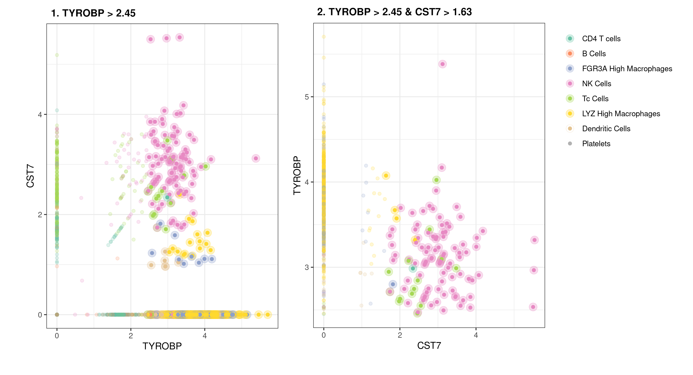

# Summary

Single-cell RNA sequencing (scRNA-seq) is now a commonly used technique to measure the transcriptome of populations of cells. Clustering heterogeneous cells based on these transcriptomes enables identification of cell populations [@Trapnell2014;@Butler2018]. There are multiple methods available to identify "marker" genes that differ between these populations [@Butler2018;@Love2014;@Robinson2009].  However, there are usually too many genes in these lists to directly suggest an experimental follow-up strategy for selecting them from a bulk population (e.g. via FACS [@RN1]). Here we present scTree, a tool that aims to provide biologists using the R programming language and scRNA-seq analysis programs a minimal set of genes that can be used in downstream experiments.  The package is free, open source and available though GitHub at [github.com/jspaezp/sctree](https://github.com/jspaezp/sctree)

# Implementation and results

The underlying model behind scTree is a combination of random forest for variable
selection and a classification tree; having this model as a classifier relies on
the fact that classification trees are analogous to many approaches in biology such
as the gating strategy employed in flow cytometry or Fluorescence assisted
cell sorting (FACS) experiments. In flow cytometry and FACS experiments,
populations are identified and sorted based on expression levels of distinct markers
that entail the identity or state of the chosen population. Usually such experiments
use only relative levels of marker expression, using terms such as "High" and "Low"
[@Coquery2012;@Robertson2005].

In a similar manner, scTree produces accurate, biologically relevant, and easily
interpretable results, which can be used for subsequent subpopulation sorting and
biological validation by fitting shallow decision trees analogous to FACS sorting
strategies and is able to output these classifiers in a format easily interpretable
in a wet-lab setting.

The method to calculate variable importances based on random forests
has been previously described, and has been implemented
in R by the `ranger` package [@Altmann2010;@Janitza2018;@Wright2017].
The suggestion of gating strategies is achieved by fitting a classification tree using the implementation
provided by the `partykit` R package [@Zeileis2015].

In order to benchmark the quality of markers, we utilized a recall-based
strategy. Briefly, each dataset was split randomly into two sections,
a training set with 80% of the cells and a testing set consisting of the 20% remaining.
A classifier was trained by selecting the top 5 markers suggested for each
cluster by either scTree (Altman method) or by two of the most commonly used marker gene detection methods for scRNA-seq data: t-tests or wilcoxon-tests (as implemented by [Seurat v3.0.1](https://web.archive.org/save/https://satijalab.org/seurat/)).

These classifiers were then used to predict the identity of the testing
set and the quality was assesed by comparing the recall, accuracy and precision
of the prediction. We were concerned that the forest-based markers would artificially
favor scTree, therefore we utilized several classifiers for the markers derived from
either scTree, t-tests or wilcoxon-tests.
As shown in **Figures 1 and 2**, bias was not observed, and regardless of the final
classification model, the features selected by using scTree provide a comparable accuracy, precision and recall to those acquired using traditional differential expression methods. It is important to note that many of the wrongly assigned labels happen between cell populations that are hard to define in-vivo and are not resolved clusters in the UMAP dimensional reduction, such as macrophage subtypes and between NK and Tc cells.


![**Depiction of the predicted identities in the PBMC 3k dataset dataset.** **A.** Real identities are the identities as identified through unsupervised clustering performed using Seurat and annotated based on prior knowledge [@Butler2018]. **B.** The scTree package was then used to classify cells based on the top 5 markers for each cluster chosen by scTree and accurately recapitulates the original classification determined by Seurat. **C.** Confusion matrix showing the assigned classification to each cluster.](./paper_figures/pbmc_prediction_sctree.png "Figure 2")

## Example Output from the package

### Predictor generation

As mentioned previously, a main focus in the development of scTree was the biological
interepretability of the models. Therefore the models can be expressed as a Garnett file,
as shown in **Code Section 1**, as specified originally in the Garnett manuscript by the
Trapell lab [@Pliner2019].
Visualizations are designed to resemble flow cytometry results, as show in **Figure 3**
and connections with several antibody vendors are provided to query the availability of
probes for the genes found to be usefull for classification.

``` r
as.garnett(tree_model, rules_keep = "^NK")
# > NK Cells 	(n = 88)
# expressed above: CST7 1.636, TYROBP 2.451
```

**Code Section 1.** *Suggested classification scheme for NK cell cluster of the PBMC dataset.*
*The data depicts how the cluster corresponding to NK cells can be predominantly identified as GNLY High/GZMB High.*



Despite scTree being originally developed for single
cell sequencing, we recognize it could also be used for other high content single-cell
workflows, such as CyTOF or data driven multiple-channel flow cytometry.

### Antibody querying interface

The provided interface with antibody databases, further enhances the utility of scTree by
fulfilling the need to interface *in silico* models and data with *in vitro*
followup. Therefore, a package interface with common antibody vendors
and search engines are provided. This interface is exemplified in **Code section 2**.

``` r
require(sctree)
head(query_biocompare_antibodies("CD11b"))
#>                                   title            vendor
#> 1         Anti-CD11b antibody [EPR1344]             Abcam
#> 2             Anti-CD11b/ITGAM Antibody         BosterBio
#> 3    Anti-CD11b/ITGAM Picoband Antibody         BosterBio
#> 4 Anti-CD11b Rabbit Monoclonal Antibody         BosterBio
#> 5  Monoclonal Antibody to CD11b (human)   MyBioSource.com
#> 6                Anti-CD11b (Mouse) mAb MBL International
#>                                                         specification
#> 1 Applications: WB, IHC-p; Reactivity: Hu, Ms, Rt, Pg, RhMk; Conjugat
#> 2             Applications: Western Blot (WB); Reactivity: Hu, Ms, Rt
#> 3   Applications: WB, FCM, ICC, IHC-fr, IHC-p; Reactivity: Hu, Ms, Rt
#> 4                       Applications: WB, IF, IHC; Reactivity: Hu, Ms
#> 5              Applications: Flow Cytometry (FCM); Reactivity: Human 
#> 6              Applications: Flow Cytometry (FCM); Reactivity: Mouse 
```

**Code Section 2.** *Example of the automated antibody query interface*

Additional usage cases and up-to-date code snippets of the common functions can be found
in the package documentation website
([jspaezp.github.io/sctree/](https://jspaezp.github.io/sctree/)) and the readme file hosted
in the github repository ([github.com/jspaezp/sctree](https://github.com/jspaezp/sctree)).

# Methods

## Testing dataset processing

The filtered raw counts for each dataset were downloaded from the 10x website
[single cell expression datasets](https://support.10xgenomics.com/single-cell-gene-expression/datasets)
[@tenxgenomics] and were processed by the standard Seurat workflow, as described in the
[package tutorial](https://web.archive.org/save/https://satijalab.org/seurat/v3.1/pbmc3k_tutorial.html) [@satijalab].
This process was carried out for the following datasets:

1. 3k PBMC, Peripheral Blood Mononuclear Cells (PBMC)
2. 50\%:50\% Jurkat:293T Cell Mixture, originally published by Wan, H. et al. in 2017

## Description of the benchmarking process

Briefly, each dataset was split into a testing and a training set. For each cluster,
each of the different marker identification methodologies was used and the top five
markers were selected. These five markers were used to
train a prediction model on the training set and the predicitons were carried out on the
testing set. These predictions were compared with the assigned cluster identity and
performance metrics were calculated.

## Formulas defining the prediction quality

$$
precision = \frac{True\ Positives}{True\ Positives + False\ Positives}
$$

$$
recall = \frac{True\ Positives}{True\ Positives + False\ Negatives}
$$

$$
accuracy = \frac{True\ Positives +  True\ Negatives}{Total}
$$


# Acknowledgments

This study was supported by the Computational Genomics Shared Resource at the Purdue
University Center for Cancer Research (NIH grant P30 433 CA023168), IU Simon Cancer
Center (NIH grant P30 CA082709), and the Walther Cancer Foundation.

# References
