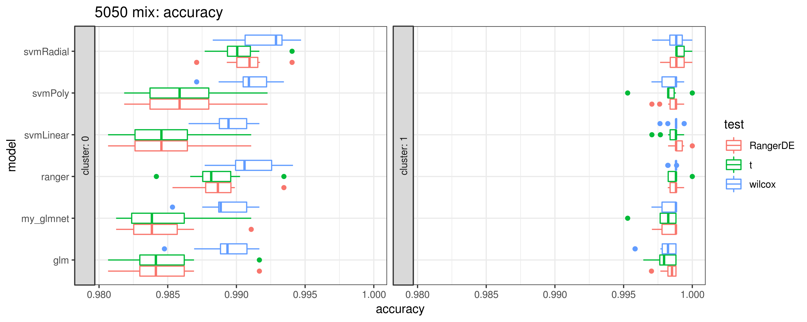
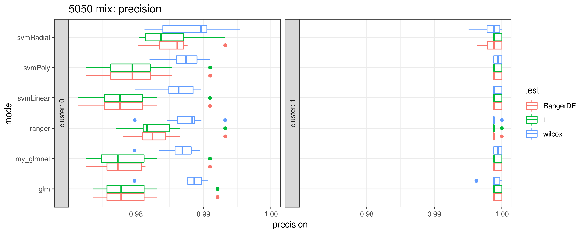
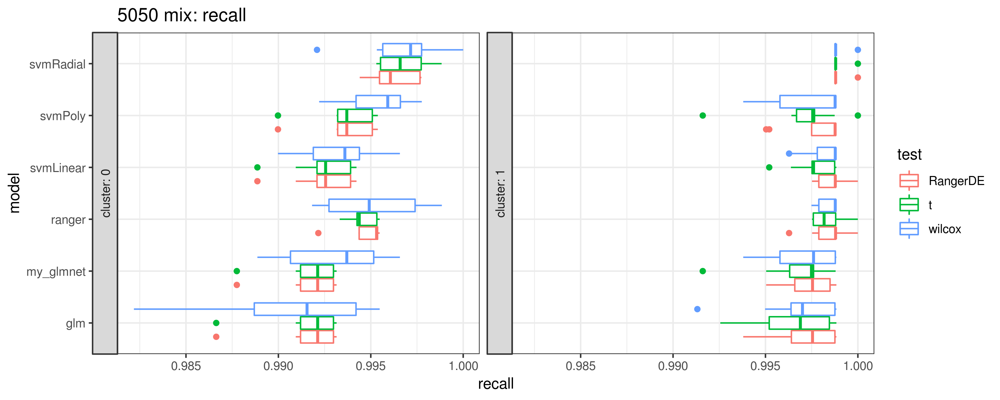
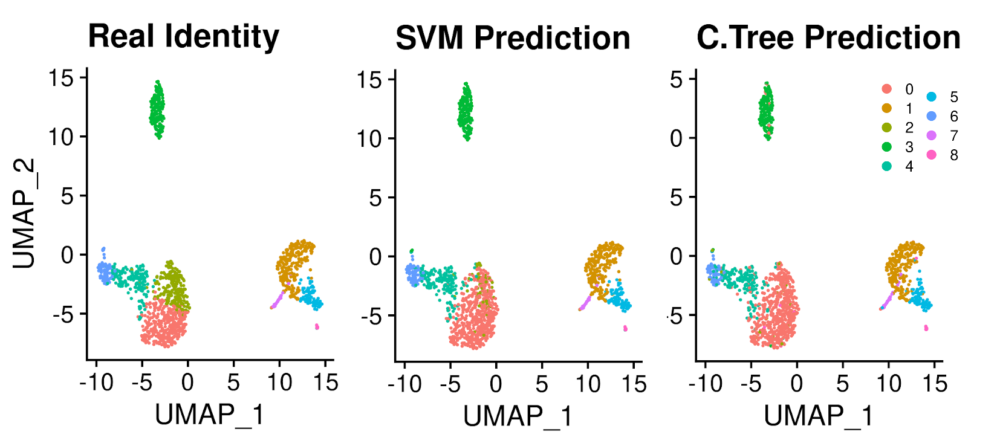
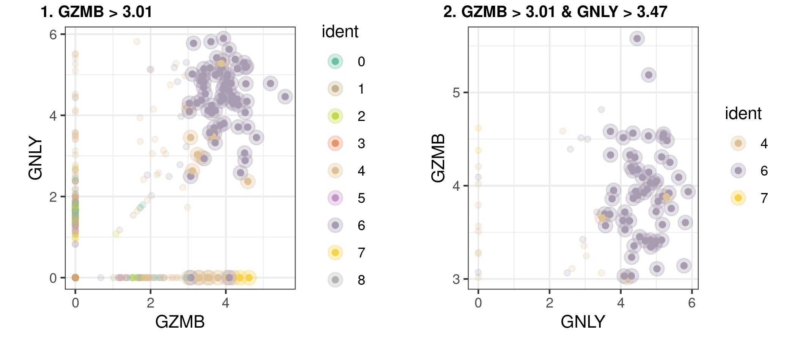

```{r, include=FALSE}
options(tinytex.verbose = TRUE)
```

# Summary

Due to the advancements in droplet-based library preparation, in combination with
the steady decrease in the cost of sequencing, the access to single-cell mRNA
sequencing (scRNA-seq) methods has finally reached research labs whose focus is
to attain insights into the biology of heterogeneous cell populations.
Nonetheless, translating hypotheses acquired by the sequencing technology
usually requires follow-up and validation by using wet-lab methods with
single-cell resolution such as immunohistochemistry (IHC), flow cytometry (FC)
and Fluorescent in-situ hybridization (FISH).
This transition remains challenging, in part because wet-lab methodologies
often rely on antibody-based technologies, which have a limited extent of
dimensionality.

Many bioinformatic tools have been developed for scRNA-seq address important
questions; such as short sequence read alignment
[@Patro2017, @Dobin2013, @Srivastava2018, @Bray2016],
barcode calling, unique molecular identifier (UMI) assignment
[@Smith2019],
pre-processing of the data
[@VanDijk2018, @Li2018],
clustering of cell subpopulations
[@Trapnell2014, @Butler2018],
and differential expression analysis
[@Love2014, @Robinson2009].
Unfortunately, most of them fail to connect directly these findings with the
requirements of the techniques that need to be used downstream to find additional
meaning in these populations. The identification of "markers" is usually done in
two distinct manners; some methods suggest markers based on one-dimensional
regression approaches and others treat the elucidation of markers as a
classification problem.  The regression methods often lead to a multitude of
differentially expressed genes identified by clusters, which though useful,
are often not ideal for separating clusters from one another due to a continuum
of expression in cells beyond the cluster of interest. The classification methods
usually rely on high dimensional methods that despite showing high classification
accuracy, make it difficult to extract from the model any information which would
be usable in an experimental setting.

We present scTree, a tool which aims to address this unfulfilled need, where the
identification of markers is considered as a classification problem modeled with
shallow decision trees. This former approach produces classification models for cell
clusters that are immediately applicable to experimental settings and without
sacrificing the classification accuracy that can be achieved. 
The package is free, open source and availabe though github at [github.com/jspaezp/sctree](https://github.com/jspaezp/sctree)

# Implementation and results

The underlying model behind sctree is a combination of random forest for variable
selection and a classification tree; having this model as a classifier relies on
the fact that classification trees are analogous to many approaches in biology such
as the gating strategy in a flow cytometry experiment, as the ones described in
[@Coquery2012 and @Robertson2005], where populations are
differentiated and sorted based on their expression levels of distinct markers that
entail the identity or state of the chosen population,
usually has only relative levels,
such as "CD8 High, CD4 Low ...".  
Sctree produces accurate, biologically relevant, and easily interpretable results,
which can be used for subsequent subpopulation sorting and biological validation.

The method to calculate variable importances based on random forests
is described in [@Altmann2010 and @Janitza2018], which is implemented
in R by the `ranger` package [@Wright2017]. And the suggestion of gating
strategies is done by fitting a clasification tree with the implementation
provided by the `partykit` R package [@Zeileis2015].

In order to benchmark the quality of the markers, we opted for a recall-based
strategy. Briefly, each dataset was split randomly into two sections,
a training with 80% of the cells and a testing set with the 20% remaining.
A classifier was trained by selecting the top 5 markers sugested for each
cluster by either sctree (Altman method), t-test and wilcoxon-test
(as implemented by seurat v 3.0.1).

These trainning classifiers were then used to predict the identity of the testing
set and the quality was assesed by comparing the recall, accuracy and precision
of the prediction. We attempted several classifiers from the different sources of
markers, because we were expecting the forest-based markers to artifially favor the
metrics on tree-based models. Nonetheless we noticed that this was not the case and
were able to shown in **Figures 1 and 2** that regardless of the final classification
model, the features selected by using scTree provide a comparable accuracy, precision
and recall to the ones acquired with differential expression methods.





Figure 1. Depiction of the quality metrics for the Jurkat:293 mixture dataset.



Figure 2. Depiction of the predicted identities in the PBMC 3k dataset dataset.


## Example Output from the package

As mentioned before, a main focus in the development of sctree was the biological
interepretability of the models, therefore he models can be expressed as a garnett file,
as shown in **Figure 4**
(as specified originally in [@Pliner2019]); And visualizations are made to resemble flow
cytometry results **Figure 5** and connections with several antibody vendors are provided
to query the availability of probes for the genes found to be usefull for classification.

Additional information on the usage of the package can be found in the companion documentation website for the package at [jspaezp.github.io/sctree/](https://jspaezp.github.io/sctree/).

```
> as.garnett(clus6_ctree_fit, rules_keep = "^clus")
# > clus 6_node_11 	(n = 59)
# expressed above: GNLY 3.479, GZMB 3.017
#
# > clus 6_node_8 	(n = 14)
# expressed above: FGFBP2 2.938
# expressed below: GZMB 3.017
```

Figure 4. Suggested classification scheme for cluster 6 in the PBMC dataset.
Depicting how it can be identified predominantly as GNLY high and GZMB High,
nonetheless a minority can also be classified as GZMB low FGFBP2 High.



Figure 5


# Methods

## Formulas defining the prediction quality:

$$
precision = \frac{True\ Positives}{True\ Positives + False\ Positives}
$$

$$
recall = \frac{True\ Positives}{True\ Positives + False\ Negatives}
$$

$$
accuracy = \frac{True\ Positives +  True\ Negatives}{Total}
$$

## Pseudocode of the benchmarking process

>
> Split training and testing set
>
> for each cluster
>
>     for each "differential expression" method
>
>         Find top 5 markers on the training dataset
>
>         for each prediction model
>
>             fit on the training set using the markers as predictors
>
>             predict the cluster identity of the cells in the testing dataset
>
>             calculate performance metrics
>
>         end
>
>     end
>
> end

## Testing dataset processing

The filtered raw counts for each dataset were downloaded from the 10x website
[Single cell expression datasets](https://support.10xgenomics.com/single-cell-gene-expression/datasets)
and processed by the standard seurat workflow,
as described in the package website.
This process was acarried out for the following datasets:

1. 3k PBMC, Peripheral Blood Mononuclear Cells (PBMC)
2. 50\%:50\% Jurkat:293T Cell Mixture, originally published by Wan, H. et al. in 2017

# References
